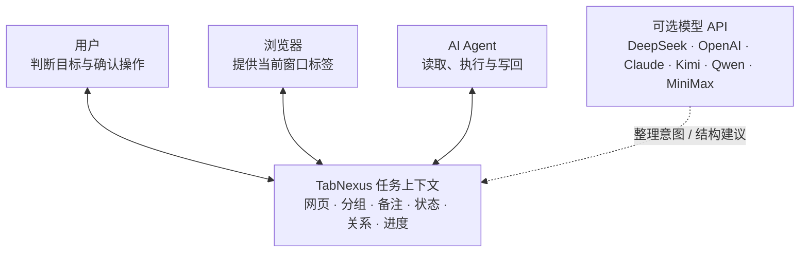
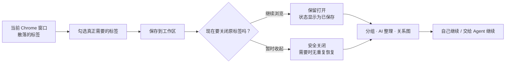
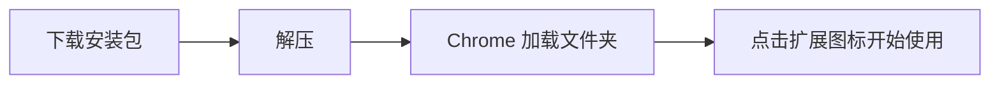
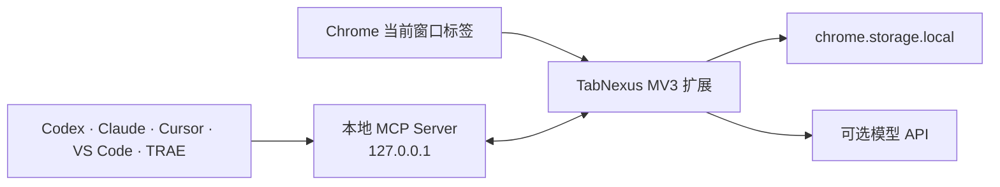

<div align="center">
  
  <h1>TabNexus</h1>
  <p><strong>一个让用户、浏览器和 AI Agent 共享任务上下文的网页 Tab 工作台。</strong></p>
  <p>把不敢关掉的几十个标签，变成一个可保存、可理解、可协作，随时能继续的工作现场。</p>

  <p>
    <a href="#install">立即安装</a> ·
    <a href="#core">核心能力</a> ·
    <a href="#agent">Agent MCP</a> ·
    <a href="docs/README.en.md">English</a>
  </p>

  <p>
    
    
    
    
    
  </p>
</div>

<picture></picture>

> [!IMPORTANT]
> **当前是 v0.17.0 开发者预览版。** 已提供两分钟安装包，不需要 Node、pnpm 或终端；Chrome 应用商店版本尚未发布。

## 😵 关不掉的标签

早上查行业报告，中午处理线上问题，晚上规划旅行。每切换一次任务，浏览器里就多出一批“等会儿再看”的页面。

每个标签都像给未来自己的一个承诺：**“这个还有用，先别关。”**

可当标题挤成一排图标，你已经分不清：

- 🔎 为什么打开这个页面？
- 🧩 它属于哪一个任务？
- ✅ 哪些已经看过，哪些才是结论？
- 🔁 关掉以后，下次从哪里继续？

浏览器记住了页面，却没有记住任务的来龙去脉。真正累人的不是标签数量，而是每次回来都要重新拼起上下文。

<picture></picture>

**TabNexus 解决的不是“把标签藏起来”，而是让未完成的工作可以安全暂停、清晰恢复，并继续流动。**

## ✨ 整理前后

下面来自**同一次真实扩展运行**：同样的 12 个脱敏网页，整理前散落在当前窗口，整理后进入三个可继续工作的分组。

| 😵 使用前｜网页都在，任务结构不在 | ✨ 使用后｜上下文被保存，也能继续流动 |
|---|---|
| <picture></picture> | <picture></picture> |

| 使用前 | 使用 TabNexus 后 |
|---|---|
| 不敢关，怕页面和思路一起消失 | 保存与关闭分开，确认状态后再放心关闭 |
| 恢复一堆 URL，仍要重建任务 | 分组、备注、状态、关系与进度一起恢复 |
| 每次向 AI 重讲背景并粘贴链接 | Agent 读取同一工作区，继续执行并写回结果 |

## 🧩 共享上下文

TabNexus 的核心不是“另一个收藏夹”，而是让**你、当前浏览器窗口和 AI Agent 围绕同一份任务上下文协作**。模型 API 是其中的可选助手：它帮助理解整理意图和建议任务结构，但最终操作始终由用户预览、修改和确认。



## ⚡ 30 秒看懂



右侧「标签操作台」始终显示当前窗口，并区分：**未保存且打开、已保存且打开、已保存但已关闭、已关闭且未保存**。保存和关闭是两个明确动作；固定标签不会被批量关闭。

<a id="install"></a>
## 🚀 两分钟安装

**不需要终端，不需要安装开发工具，通常两分钟内完成。**

### 1. 📦 下载

点击 **[下载 TabNexus Chrome 安装包](https://github.com/KaichenCurry/TabNexus/releases/download/v0.17.0/TabNexus-Chrome-v0.17.0.zip)**，下载后双击解压。

### 2. 🧩 打开

在 Chrome 地址栏粘贴 `chrome://extensions` 并回车，然后打开右上角的 **开发者模式**。

### 3. ✅ 加载

点击 **加载已解压的扩展程序**，选择刚刚解压出来的 `TabNexus-Chrome-v0.17.0` 文件夹。

最后，把 TabNexus 固定到浏览器工具栏并点击图标，就可以开始使用。



> 更新版本时，重新下载并解压，在 `chrome://extensions` 中删除旧版后加载新文件夹即可。使用本地 `file://...html` 页面时，请在扩展详情中开启「允许访问文件网址」。

<details>
<summary><strong>开发者：从源码构建</strong></summary>

```bash
git clone https://github.com/KaichenCurry/TabNexus.git
cd TabNexus
corepack enable
pnpm install --frozen-lockfile
pnpm build
```

构建完成后，在 Chrome 中加载项目的 `dist` 文件夹。源码版用于开发、运行测试，以及连接 Codex、Cursor、VS Code、TRAE 等本地 Agent。
</details>

<a id="first-use"></a>
## 👋 第一次使用

1. **先选，不必全收。** 在右侧标签操作台勾选这次任务真正需要的标签；「全选」会自动跳过固定标签。
2. **点击保存。** 标签立即进入当前工作区，原网页默认继续保持打开；已保存状态会显示在标签旁。
3. **需要安静时再关闭。** 选中标签后点击「关闭」，或在设置里开启「保存后关闭」。关闭不会删除工作区卡片。
4. **建立工作结构。** 手动拖入分组、输入一句话让 AI 按你的规则整理，或切换到关系图梳理关联。
5. **随时恢复。** 打开单张卡片、一个分组或整个工作区；已经打开的 URL 不会重复创建。

<a id="core"></a>
## 🧱 三层能力

### 1. 🗂️ 标签工作区

从当前窗口多选真正属于任务的标签，采集、分组、保存，再明确决定是否关闭原网页。Workspace 彼此隔离，保存状态始终可见；恢复一张卡片、一个分组或整个工作区时，已打开的 URL 会自动跳过。

需要整理时，可以手动拖拽，也可以让 DeepSeek 等可选模型按网页类型、最近访问时间、任务阶段、优先级或自定义意图提出方案；没有 API Key 时仍可使用本地域名整理。

**得到的不只是更干净的标签栏，而是“现在可以安全停下来，之后还能接着做”的确定感。**

| 工作区全景 | 按意图整理 |
|---|---|
| <picture></picture> | <picture></picture> |
| 保存状态、分组卡片和当前窗口标签放在同一视线内。 | 先选择范围，再输入自己的分类规则，不把整理方式写死。 |

### 2. 🧠 任务思路

同一批资料可以在卡片看板与无限关系图之间切换。看板适合快速分组、记录备注与推进阅读状态；关系图适合梳理证据、结论、依赖和下一步，并保存卡片位置、连线与任务进度。

AI 在这里承担“结构助手”的角色：根据你的目标建议分组、关系和任务阶段，先展示分类依据与变更预览；你可以修改归属与结构，再决定是否应用。

**你管理的不再是网址列表，而是一个能看见思路、关系和进度的任务空间。**

| 无限关系图 | 整理预览 |
|---|---|
| <picture></picture> | <picture></picture> |
| 在无限画布中组织资料、依赖和下一步，位置与连线会持续保存。 | 分类依据、移动范围和结果先展示；不满意可以调整，再决定是否应用。 |

### 3. 🤝 Agent 协作

TabNexus 通过 MCP 成为 Codex、Claude、Cursor、VS Code 和 TRAE 的本地上下文层。Agent 可以读取当前任务和浏览器标签、搜索工作区、添加资料、调整分组与关系图、写回报告和任务结构建议，也能在确认保护下保存、关闭或恢复网页。

**你不必再把背景、链接和最新进度重新讲一遍；Agent 接手的是同一个持续更新的工作现场。**

| Agent 连接 | Agent 写回 |
|---|---|
| <picture></picture> | <picture></picture> |
| 按正在使用的客户端选择最短接入方式，一次安装后直接在 Agent 对话中使用。 | 每次读取、添加资料、调整结构和写回结果都留下清楚的活动记录。 |

<a id="agent"></a>
## 🔌 连接 Agent

| 客户端 | 本地支持 | 接入方式 |
|---|---:|---|
| Codex | ✅ | 仓库插件包 |
| Claude Desktop | ✅ | 自包含 `.mcpb` 扩展包 |
| Claude Code | ✅ | 仓库 Marketplace 插件 |
| Cursor | ✅ | 标准本地 MCP 配置 |
| VS Code / Copilot Agent | ✅ | VS Code MCP 配置 |
| TRAE Work | ✅ | 标准本地 MCP 配置 |
| 扣子 Coze | 规划中 | 需要独立鉴权的远程 MCP 网关 |

本地 MCP 提供 **17 个工具**，覆盖工作区、分组、卡片、关系图、标签选择、保存、恢复、导出以及带确认保护的关闭和删除。多 Agent 可同时连接；写入使用 revision 和幂等操作 ID，避免旧会话静默覆盖新内容。

安装扩展后，打开 **设置 → 连接你常用的 Agent**，选择客户端并按页面提示操作。详细资料见[客户端适配说明](docs/AGENT_CLIENT_ADAPTERS.md)、[能力矩阵](docs/MCP_CAPABILITY_MATRIX.md)和[测试指南](docs/MCP_TESTING.md)。

## 🔐 隐私安全

- 工作区与模型密钥保存在 Chrome 本地存储；没有 TabNexus 账号和云端数据库。
- 不使用内容脚本、`<all_urls>`、`webRequest`、`downloads` 或新标签页劫持。
- AI 只在你主动整理时发送必要的卡片 ID、标题和 URL；不会发送备注和密钥。
- MCP 只监听 `127.0.0.1`，不会向 Agent 暴露模型密钥。
- 导出不会包含设置、凭据或临时 Chrome tabId。
- 固定标签可以手动保存，但无法通过批量操作或 MCP 关闭。

发现安全问题时，请阅读[安全策略](.github/SECURITY.md)并使用 GitHub 私密漏洞报告。不要在 Issue、截图、fixture 或导出中粘贴真实 API Key。

## 🛠️ 开发验证

```bash
pnpm dev                  # 使用脱敏模拟标签预览真实 UI
pnpm typecheck
pnpm test                 # 单元、组件、Manifest 与 Chrome API 测试
pnpm test:e2e             # Chrome for Testing 扩展端到端测试
pnpm check                # 类型、测试、MCP 合约与生产构建
pnpm mcp:test             # 通过真实 stdio 进程验证全部 17 个工具
pnpm eval:mcp:validate    # 校验 600 条 MCP 评测数据集
```

当前自动化基线：**106 项测试、17/17 MCP 工具、36/36 项确定性能力检查**。

<details>
<summary><strong>仓库结构</strong></summary>

```text
agent/   MCP bridge、客户端适配与 Agent 插件
docs/    产品、实现、测试与公开文档
public/  Chrome Manifest、图标与发布资源
scripts/ 构建、安装、审计与评测脚本
src/     React 工作区、设置页、数据与 Chrome 服务逻辑
tests/   单元、组件、E2E、fixtures 与 MCP 评测集
```

根目录只保留构建配置、许可证、变更日志和项目入口；历史 PRD 已归档到 [`docs/product/PRD.md`](docs/product/PRD.md)。
</details>

## 🧭 技术架构



技术栈：React、TypeScript、Vite、Vitest、Playwright、Chrome Manifest V3、Model Context Protocol。所有运行时代码与字体随扩展打包，不执行远程托管代码。

## 📍 项目状态

已经实现：

- 多工作区标签保存、去重、关闭、恢复、过滤、拖拽、备注、状态与导出；
- 按用户意图进行的多模型 AI 整理与可编辑预览；
- 可持久化布局与连线的无限关系画布；
- 覆盖工作区和标签操作台的本地多 Agent MCP；
- 中文主界面与英文界面。

接下来：

- Chrome Web Store 签名安装与自动更新；
- 面向扣子等云端 Agent 的鉴权远程 MCP；
- 更完整的无障碍、快捷键与大型工作区性能验证。

完整进度见[实现状态](docs/IMPLEMENTATION_STATUS.md)。

## 🤝 参与贡献

欢迎提交体验反馈、文档改进、模型适配、无障碍优化与聚焦的 Pull Request。开始前请阅读[贡献指南](.github/CONTRIBUTING.md)与[社区行为准则](.github/CODE_OF_CONDUCT.md)。

有功能建议、体验问题或后续优化想法，也可以直接发送邮件至 **[currykchen@hotmail.com](mailto:currykchen@hotmail.com)**。

## License

TabNexus 使用 [MIT License](LICENSE)。

---

<div align="center">
  <strong>浏览器保存了页面。TabNexus 保存你为什么打开它们，以及接下来要做什么。</strong>
</div>
