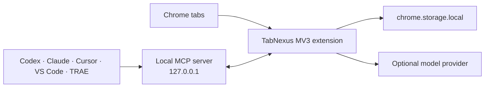

<div align="center">
  
  <h1>TabNexus</h1>
  <p><strong>Turn tab overload into a workspace you can resume, understand, and hand to an AI Agent.</strong></p>
  <p>A local-first Chrome extension for people whose browser is part of their thinking process.</p>

  <p>
    <a href="#quick-start">Quick start</a> ·
    <a href="#three-ways-tabnexus-helps">Why TabNexus</a> ·
    <a href="#agent-collaboration-mcp">Agent MCP</a> ·
    <a href="docs/README.zh-CN.md">简体中文</a>
  </p>

  <p>
    
    
    
    
    
  </p>
</div>


> **Developer preview — v0.17.0.** TabNexus is ready for local dogfooding and source builds. Chrome Web Store distribution is not available yet.

## Your tabs are not the problem. Losing the work behind them is.

A busy browser usually contains several unfinished tasks at once: research for a decision, references for a feature, a trip being planned, documents waiting to be read. The browser remembers that the pages are open, but not why they belong together or what should happen next.

The usual choices each solve only part of that problem:

| Approach | What it does well | What often gets lost |
|---|---|---|
| Bookmarks | Keeps a URL for later | Task context, order, status, and relationships |
| Tab groups and session managers | Preserves or restores a browser session | Meaningful project structure and durable notes |
| Knowledge-base tools | Organizes polished knowledge | The low-friction flow from live tabs to working context |
| **TabNexus** | Turns live tabs into local workspaces, then lets people and Agents operate the same structure | You keep control: every important change is reviewable and destructive actions require confirmation |

TabNexus is the bridge between a temporary browser session and a reusable body of work. Save the context, close the noise, and come back without reconstructing your train of thought.

## What you gain

- **Close tabs with confidence.** Saved pages remain in the workspace even after the browser tab is gone, and existing pages are not duplicated when you restore them.
- **Resume a project in seconds.** Groups, notes, reading states, order, and relationships survive Chrome and extension restarts.
- **Organize by your intent.** Ask for grouping by page type, recency, workflow stage, priority, topic, or your own rule; TabNexus does not force everything back into topic folders.
- **Give an Agent usable context.** Codex, Claude, Cursor, VS Code, and TRAE can read and safely edit the same workspace through a local MCP connection.
- **Keep ownership of your data.** Workspaces and provider keys stay in Chrome local storage. There is no TabNexus account or cloud backend.

## Three ways TabNexus helps

### 1. From open tabs to durable workspaces

Select the tabs that matter, save them into a project, and close the originals when you are ready. The right-side tab workbench makes the state explicit: open and unsaved, saved and open, saved but closed, or recently closed without being saved.

Inside the workspace you can create groups, move cards, add notes, mark sources as **To read**, **Read**, or **Adopted**, and restore one card, one group, or the whole workspace without duplicate tabs.

**Benefit:** fewer open tabs without the fear of losing the task.

### 2. AI organization that follows your instruction

TabNexus can organize a workspace or only the tabs you selected. You describe the dimension that matters; the model returns a compact proposal with its classification basis, destination groups, and per-page assignments. Rename groups or redirect individual pages before applying it.

Supported optional providers: DeepSeek, OpenAI, Claude, Kimi, Qwen, and MiniMax. AI is off by default, keys are supplied by the user, and a deterministic local domain grouping remains available without an API key.

The same cards can switch to an Obsidian-inspired relationship map with an infinite canvas, positioning, selection, pan/zoom, minimap, and editable relationships.

**Benefit:** structure adapts to the work instead of forcing the work into a fixed taxonomy.

### 3. A shared context layer for your AI Agent

The local MCP bridge gives an external Agent 17 focused tools for workspace discovery, search, capture, classification, notes, status, ordering, relationship layout, browser-tab selection, saving, restoring, exporting, and guarded closing or deletion.

Agents operate with versioned revisions and idempotent operation IDs, so concurrent sessions cannot silently overwrite newer work. API keys are never exposed through MCP. Destructive calls require the user's literal confirmation text.

**Benefit:** your Agent can act on browser context without asking you to paste a flat list of URLs into every conversation.

## Quick start

### Requirements

- Google Chrome 118+
- Node.js 22+
- pnpm 11 (`corepack enable` if pnpm is not already available)

### Build and load the extension

```bash
git clone https://github.com/KaichenCurry/TabNexus.git
cd TabNexus
corepack enable
pnpm install
pnpm build
```

Then open `chrome://extensions`:

1. Enable **Developer mode**.
2. Click **Load unpacked**.
3. Select the generated `dist` directory.
4. Pin TabNexus and click its toolbar icon.

TabNexus opens or focuses one standalone `workspace.html` extension page. It does not replace your new-tab page and does not use Chrome's Side Panel.

For local `file://...html` pages, enable **Allow access to file URLs** in the extension details.

## Agent collaboration (MCP)

Build the project, reload the extension, then open **Settings → Connect your AI assistant**. Choose your client and follow the in-product setup.

| Client | Local support | Integration |
|---|---:|---|
| Codex | ✅ | Repository plugin package |
| Claude Desktop | ✅ | Self-contained `.mcpb` bundle |
| Claude Code | ✅ | Repository marketplace plugin |
| Cursor | ✅ | Standard local MCP configuration |
| VS Code / Copilot Agent | ✅ | VS Code MCP configuration |
| TRAE Work | ✅ | Standard local MCP configuration |
| Coze | Planned | Requires a separately authenticated remote MCP gateway |

All local clients use the same dependency-free stdio server and MCP `0.8.0` contract. See the [client adapter guide](docs/AGENT_CLIENT_ADAPTERS.md), [capability matrix](docs/MCP_CAPABILITY_MATRIX.md), and [testing guide](docs/MCP_TESTING.md).

## Privacy and security

- Local-first storage; no TabNexus account or cloud synchronization.
- No content scripts, `<all_urls>`, `webRequest`, `downloads`, or new-tab override.
- Provider host permissions are explicitly allowlisted in the MV3 manifest.
- AI requests send only the minimum card metadata required for the selected operation—never provider keys or card notes.
- Exports exclude settings, credentials, and ephemeral Chrome tab IDs.
- MCP listens only on `127.0.0.1`, validates the extension connection, and never exposes provider keys.
- Pinned tabs can be saved when explicitly selected but cannot be closed through MCP.

Read [SECURITY.md](SECURITY.md) before reporting a vulnerability. Never include a real provider key in an issue, screenshot, fixture, export, or committed file.

## Development

```bash
pnpm dev                  # visual preview with synthetic local tabs
pnpm typecheck
pnpm test                 # unit, component, manifest, and Chrome API tests
pnpm test:e2e             # extension E2E in Chrome for Testing
pnpm check                # full typecheck, tests, MCP contract, and build
pnpm mcp:test             # exercises all 17 tools through a real stdio process
pnpm eval:mcp:validate    # validates the curated 600-query evaluation dataset
pnpm eval:mcp:contract    # checks exact MCP version and tool parity
```

Current automated baseline: **106 tests**, **17/17 MCP tools**, and **36/36 deterministic capability checks**.

## Architecture



The React workspace subscribes to Chrome tab events, while the MV3 service worker handles toolbar focus, provider requests, and the local Agent bridge. Workspace writes use revisions and retry receipts to prevent stale or duplicated mutations.

## Project status

Implemented today:

- Multi-workspace tab capture, save/close, restore, deduplication, notes, status, filters, drag and drop, and exports.
- Intent-first AI grouping with editable review and multiple provider adapters.
- Infinite relationship canvas with persistent layout and edges.
- Local multi-Agent MCP with complete workspace and tab-workbench operations.
- Chinese and English interfaces.

Next priorities:

- Public installation packages that do not require a source checkout.
- Chrome Web Store packaging and review materials.
- Authenticated remote MCP for cloud Agents such as Coze.
- More accessibility, keyboard, and large-workspace performance testing.

See [implementation status](docs/IMPLEMENTATION_STATUS.md) for the detailed milestone record.

## Contributing

Issues, product feedback, documentation improvements, provider adapters, accessibility fixes, and focused pull requests are welcome. Start with [CONTRIBUTING.md](CONTRIBUTING.md) and follow the [Code of Conduct](CODE_OF_CONDUCT.md).

## License

TabNexus is available under the [MIT License](LICENSE).

---

<div align="center">
  <strong>Your browser holds the work. TabNexus makes the work usable again.</strong>
</div>
