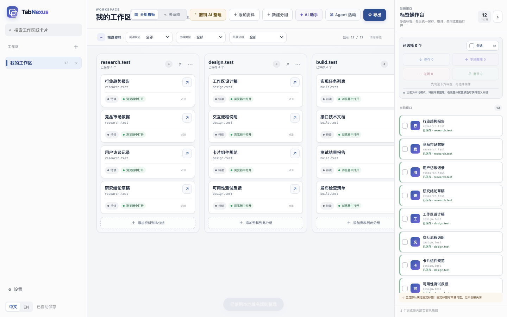
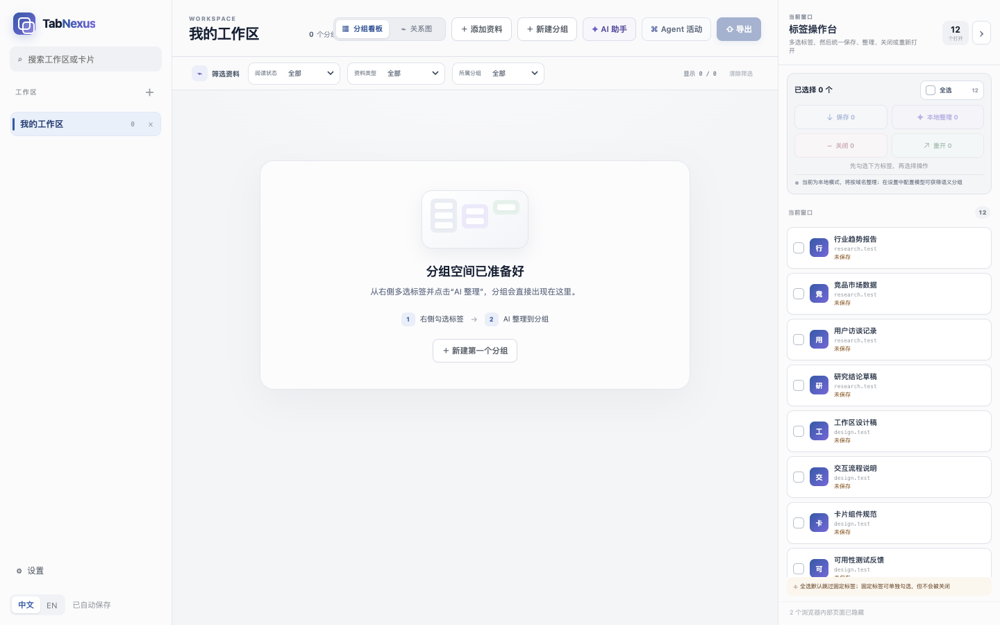
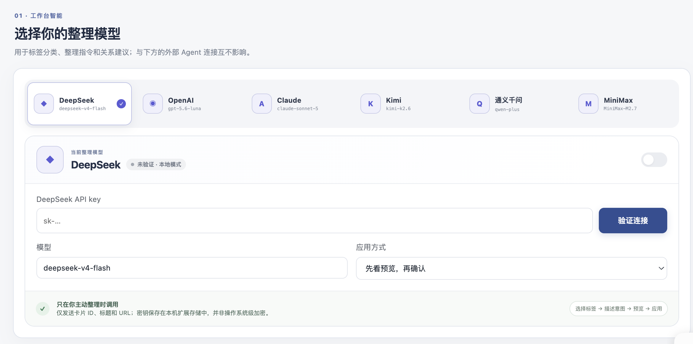
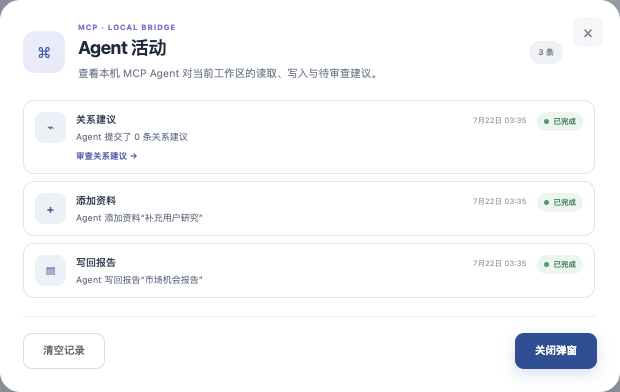

  
  <h1>TabNexus</h1>
  
<strong>你开的不是标签页，是一件还没做完的事。 TabNexus 把散乱 Tabs 变成你和 AI 都能接着用的任务上下文。</strong>

  
本地整理开箱即用 · 配置 AI API 后按意图升级 · 需要时再接入 MCP Agent

  

    <a href="#why">为什么</a> ·
    <a href="#what">它是什么</a> ·
    <a href="#features">完整工作流</a> ·
    <a href="#ai-api">AI API</a> ·
    <a href="#agent">Agent 协作</a> ·
    <a href="#start">两分钟上手</a> ·
    <a href="docs/README.en.md">English</a>
  

  

    
    
    
    
    
  

<picture></picture>

把网页保存成带分组、备注、状态和关系的 Workspace。原标签放心关掉，需要时一键恢复。

> [!IMPORTANT]
> **当前为 v0.17.0 开发者预览版。** 已提供可直接加载的 Chrome 安装包，Chrome Web Store 版本尚未发布。→ [两分钟上手](#start)

## 😵 你不敢关的不是 Tab，而是那件还没做完的事

你的浏览器里，也许正躺着一件你不敢结束的事。

最初只是想调研一家公司、比较几个方案，或排查一个 Bug。一个页面带出下一条线索，不知不觉就变成二十多个 Tab。你知道有些是背景、有些是证据、有些互相矛盾，还有几页没看完——但浏览器只看见二十个 URL。

**一个 Tab 只是一条线索；一组 Tab，本该是一份正在形成的判断。** 可它们为什么在一起、各自有什么作用、任务走到了哪一步，全都只存在你的脑子里。第二天回来，网页还在，思路却已经断了。

你舍不得关掉的，从来不是页面，而是那段尚未完成的思考。

<picture></picture>

Toby、OneTab、Workona 等传统工具解决了“页面太多放哪里”，却很难保留“我为什么打开它们”。到了 AI 时代，这个断层更加明显：为了让 AI 接手，你仍要逐条复制链接、重新解释背景，或者让 Computer Use / Playwright 逐页读取浏览器。你成了浏览器和 AI 之间的“人肉 API”。

这不是你不会整理，而是浏览器从来没有替你保存任务背后的“为什么”。

> [!IMPORTANT]
> **TabNexus 的出发点只有一句：别再把 Tab 当 Tab 管，把它当任务上下文。**

## ✨ TabNexus：把 Tabs 变成可继续的任务上下文

TabNexus 不是又一个把链接塞进文件夹的 Tab Manager。它想在浏览器与最终产出之间，补上一层长期缺失的东西：**任务上下文**。

普通 Tab Manager 的终点是“以后还能打开”；TabNexus 的起点是“回来就知道为什么打开、做到哪里、下一步是什么”。

~~~mermaid
flowchart LR
    Intent["🎯 想完成一件事"] --> Tabs["📑 打开 Tabs"]
    Tabs --> Workspace["📦 本地 Workspace 保存 · 恢复 · 本地整理"]
    Workspace --> Thinking["🧠 任务思路 卡片 · 关系 · 进度"]
    Thinking --> Output["✅ 产出 判断 · 报告 · 下一步"]
    API["✨ AI API 配置后按意图整理"] -. "提出结构" .-> Thinking
    Agent["🤖 MCP Agent 可选进阶协作"] <-->|读取 · 补充 · 写回| Workspace
~~~

Workspace 不是一个网页仓库，而是一件任务的现场：它保留页面的角色、彼此的关系和推进状态。你可以停在本地保存与梳理，也可以配置 AI API 帮你按意图重组；当任务还要继续研究、写作或编码时，再把同一份上下文交给 Agent。

**这不是几个互不相关的功能。保存不是终点，Agent 也不是起点；每一步都在丰富同一份 Workspace，让下一步不必从头开始。**

## 🧩 同一份上下文，四步从“页面堆积”走向“任务推进”

前两步构成完整的本地工作流：先让任务安全留下，再把思路理清；AI API 是可选增强，MCP Agent 是更进一步的协作方式。

### 1️⃣ 标签与 Workspace：终于不用靠“开着不关”提醒自己

从当前 Chrome 窗口勾选同一任务的网页，完成**采集、分组、保存**。保存后可以关闭原标签：卡片仍在本地 Workspace 中，随时恢复一张、一个分组或整个工作区。

清空标签栏，不再等于放弃任务；它只是把任务从浏览器噪音中安静地保存下来。

保存与关闭是两个明确动作：关闭原标签不会删除卡片，恢复时会避开已经打开的 URL，固定标签也不会被批量关闭。多 Workspace、备注、拖拽分组和 Markdown / JSON 导出仍然都在。

<picture></picture>

### 2️⃣ 任务思路：不是把标签排整齐，而是把问题想清楚

页面被保存，只是第一步。真正困难的是：**每张页面在这件事里意味着什么？**

- 用卡片与分组区分背景、证据、方案、反例和结论，知道每个 Tab 属于哪个环节；
- 用关系图看清支持、对比、依赖和下一步，发现哪些资料互相支撑、哪里还缺证据；
- 用“待读 / 已读 / 已采用”记录进度，不再把“以后再看”当作任务状态。

普通 Tab Manager 管理页面放在哪里；TabNexus 帮你理解页面在任务中扮演什么角色。再次打开 Workspace 时，你恢复的不只是一组网页，而是**上次思考到一半的现场**。

| 卡片看板 | 流程 / 关系图 |
|---|---|
| <picture></picture> | <picture></picture> |

### 3️⃣ AI API：先配置自己的模型，再按意图整理

按域名整理只能告诉你“页面来自哪里”，却不知道“你为什么打开它”。配置 AI 后，你可以直接说：

> “按照背景、证据、反例和结论，整理这次行业研究。”

AI 会根据你的 Query 判断页面在任务中的作用，提出分组建议，也可以单独建议关系结构；默认先展示预览，由你确认后再应用。

> [!IMPORTANT]
> **TabNexus 默认使用本地整理。要使用 AI 整理，必须先在“设置 → 选择你的整理模型”中选择服务商，填写自己的有效 API Key 和模型，并启用 AI；否则 AI 意图整理不可用，系统会保持本地模式，也不会调用外部模型。**
>
> 不配置 API 仍可完整使用采集、保存、恢复、手动及本地域名分组、卡片、关系图和进度管理。

当前支持 DeepSeek、OpenAI、Claude、Kimi、通义千问和 MiniMax。建议点击“验证连接”，成功后模型会自动启用；默认流程仍是**选择标签 → 描述意图 → 预览 → 应用**。

<picture></picture>

默认显示“本地模式”；配置并启用模型后，才可使用 AI 意图整理。

AI API 负责理解与整理 Workspace；MCP 负责把 Workspace 交给 Agent。两者互不依赖，也可以前后接力。

### 4️⃣ Agent 协作：停止充当“人肉 API”

如果你只需要保存、梳理或用 AI 分类，到上一步已经可以完整使用 TabNexus。只有当任务还要继续调研、补资料、写报告或进入开发流程时，才需要让 Agent 接手。

过去，你要么把十几个链接逐条复制给 Agent，再从头解释背景；要么让 Computer Use / Playwright 重新逐页读取。TabNexus 让支持 MCP 的 Agent 通过一个本地接口，直接获得已经整理好的分组、备注、关系和进度。

Agent 可以搜索 Workspace、添加网页或笔记、更新状态与分组、建议关系结构并写回报告。关键写入支持版本校验并记录活动，关闭或删除等破坏性操作必须由你确认。

**你负责目标与判断，TabNexus 负责上下文，Agent 从你停下的地方继续。**

| 连接常用 Agent | 查看 Agent 的读取与写回 |
|---|---|
| <picture></picture> | <picture></picture> |

## 🚀 两分钟安装，并完成第一次整理

1. **安装扩展：** 下载并解压 [TabNexus Chrome 安装包](https://github.com/KaichenCurry/TabNexus/releases/download/v0.17.0/TabNexus-Chrome-v0.17.0.zip)，打开 <code>chrome://extensions</code>，开启**开发者模式**并选择**加载已解压的扩展程序**。
2. **保存一个任务：** 打开 TabNexus，勾选属于同一任务的网页并点击**保存**。现在可以放心关闭原标签。
3. **选择整理方式：** 系统默认在本地整理；需要 AI 时，先在设置中选择模型、填写 API Key 并启用，再输入自己的整理意图。
4. **继续推进：** 在看板或关系图中标记进度，需要时恢复卡片、分组或整个 Workspace。

到这里已经可以完整使用 TabNexus——**不需要 Agent，也不需要终端。**

<strong>从源码构建</strong>

需要 Node.js 22+ 与 pnpm 11。

~~~bash
git clone https://github.com/KaichenCurry/TabNexus.git
cd TabNexus
corepack enable
pnpm install --frozen-lockfile
pnpm build
~~~

然后在 <code>chrome://extensions</code> 中加载生成的 <code>dist</code> 目录。

## 🔌 连接 Agent（可选进阶）

打开**设置 → 连接你常用的 Agent**。本地 MCP 提供 **17 个聚焦工具**，覆盖 Workspace、卡片、关系图、导出与标签操作。

<strong>已支持的客户端与技术文档</strong>

| 客户端 | 状态 | 接入方式 |
|---|:---:|---|
| Codex | ✅ | 仓库插件包 |
| Claude Desktop / Claude Code | ✅ | MCPB / Marketplace 插件 |
| Cursor / VS Code / TRAE | ✅ | 本地 MCP 配置 |
| 扣子 Coze | 规划中 | 鉴权远程 MCP 网关 |

[客户端适配说明](docs/AGENT_CLIENT_ADAPTERS.md) · [能力矩阵](docs/MCP_CAPABILITY_MATRIX.md) · [测试指南](docs/MCP_TESTING.md)

## 🔒 本地优先，边界清晰

- TabNexus 无账号、无自建云端；Workspace 和模型 Key 保存在 Chrome 本地存储；
- 只有主动调用 AI 时，用户指令和必要的任务元数据才会发往所选模型服务；不发送网页正文或卡片备注，API Key 仅用于该服务的请求鉴权；
- MCP 只监听 <code>127.0.0.1</code>，不会向 Agent 暴露模型 Key；
- 不使用内容脚本、<code>&lt;all_urls&gt;</code>、<code>webRequest</code>、下载权限或新标签页劫持；
- 关闭、删除等破坏性操作需要明确确认，导出不含凭据。

发现安全问题请阅读[安全策略](.github/SECURITY.md)，并使用 GitHub 私密漏洞报告。

## 🛠️ 已实现与下一步

**v0.17.0 已实现：**多 Workspace 的采集 / 保存 / 恢复闭环、按意图的多模型 AI 分类与可编辑预览、持久化关系画布、17 工具本地 MCP、中英双语界面。自动化基线为 106 项测试、17/17 MCP 工具、36/36 确定性能力检查。

**接下来：**Chrome Web Store 上架、面向云端 Agent 的鉴权远程 MCP、无障碍与大型 Workspace 性能。详见[实现状态](docs/IMPLEMENTATION_STATUS.md)和 [PRD](docs/product/PRD.md)。

技术栈：React · TypeScript · Vite · Vitest · Playwright · Chrome Manifest V3 · Model Context Protocol。

## 🌱 一起构建浏览器与 Agent 之间的上下文层

浏览器上下文既私人又关键，所以数据边界应该可检查、Agent 接口应该可扩展，产品方向也应该由真正被标签困扰的人共同塑造。

- 🐛 提交 [Issue](https://github.com/KaichenCurry/TabNexus/issues/new/choose)
- 💬 加入 [Discussions](https://github.com/KaichenCurry/TabNexus/discussions)
- 🔧 阅读[贡献指南](.github/CONTRIBUTING.md)
- 📮 联系：[currykchen@hotmail.com](mailto:currykchen@hotmail.com)

## 📄 License

[MIT](LICENSE)

---

  <strong>浏览器记得你打开了什么。 TabNexus 记得你为什么打开、做到了哪里，以及接下来由谁继续。</strong>

