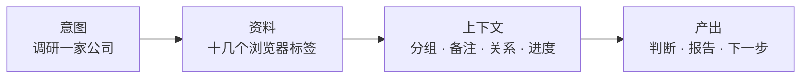
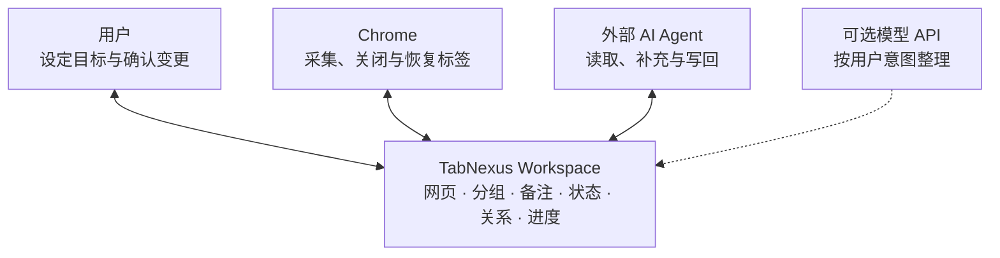
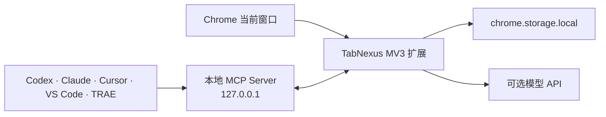

<div align="center">
  
  <h1>TabNexus</h1>
  <p><strong>把散落的浏览器标签，变成可保存、可理解、可继续、可交给 AI Agent 的任务上下文。</strong></p>
  <p>一个本地优先的 Chrome 任务工作台，为那些用浏览器思考、调研和推进工作的人而做。</p>

  <p>
    <a href="#why">为什么是 TabNexus</a> ·
    <a href="#product">产品能力</a> ·
    <a href="#start">两分钟开始</a> ·
    <a href="#agent">Agent 进阶协作</a> ·
    <a href="docs/README.en.md">English</a>
  </p>

  <p>
    
    
    
    
    
  </p>
</div>

<picture></picture>

<div align="center"><sub>同一批网页，被保存为带分组、状态和关系的 Workspace；原标签可以放心关闭，需要时随时恢复。</sub></div>

> [!IMPORTANT]
> **当前为 v0.17.0 开发者预览版。** 已提供可直接加载的 Chrome 安装包；Chrome Web Store 版本尚未发布。

<a id="why"></a>
## 你打开的不是 Tab，而是一项还没做完的任务

假设你正在调研一家公司。你会先有一个目标，然后打开产品页、行业报告、竞品资料、技术博客和用户讨论，最后形成判断或报告。



但浏览器通常只保留了中间那排标签。它记得**你打开了什么**，却不知道：

- 为什么打开它们，它们共同服务于哪个目标；
- 哪些是证据、竞品、结论或待办，彼此有什么关系；
- 任务做到了哪里，下次回来应该从哪里继续。

于是标签越开越多。你不敢关，不是因为每个页面都重要，而是担心关掉以后，连同当时的思路一起丢失。

<picture></picture>

**TabNexus 的出发点很简单：Tab 不是待处理的浏览器垃圾，而是任务上下文的原材料。**

### 为什么是现在？

AI 让这个问题变得更明显：Agent 会帮人查资料、AI 产出经常以网页呈现，人又在浏览器与 AI 工具之间来回切换。标签增长得更快，上下文却仍靠人脑维持。

过去十年，Toby、OneTab、Workona 等产品已经证明“收纳和恢复标签”是真实需求。TabNexus 在此基础上继续追问：**这些标签为什么会被打开，它们如何形成一个任务，又怎样让人或 Agent 接着完成它？**

## 从 Tab 管理到共享任务上下文

TabNexus 不是另一个书签文件夹。它把临时的浏览器会话转成一个持久 Workspace，让用户、浏览器和 AI Agent 操作同一份结构化上下文。



| 常见方式 | 能解决什么 | 仍然需要人做什么 |
|---|---|---|
| 书签、Tab Group、会话保存 | 收纳页面、恢复窗口 | 重新回忆目标、结构和进度 |
| 按域名自动分组 | 回答“页面来自哪里” | 判断“我为什么打开它” |
| 逐个复制链接给 AI | AI 能拿到 URL | 反复充当“人肉 API”，重新解释背景 |
| Computer Use / Playwright 读取浏览器 | 能操作当前界面 | 逐页定位和读取，任务结构仍需临时重建 |
| **TabNexus** | 保存并组织任务上下文，通过 MCP 交给 Agent | 用户只需决定目标并审核关键变更 |

> TabNexus 当前向 Agent 提供标题、URL、分组、备注、状态、关系等结构化上下文；它不会在后台抓取网页正文。

## 先用 AI API 整理，需要时再连接 Agent

**使用 TabNexus 不要求你先使用 Agent。** 对大多数用户，连接一个 AI API 就能完成按意图分类、结构建议和日常任务整理；当你希望 AI 进一步读取整个工作区、添加资料或写回成果时，再启用 MCP Agent 协作。

| | ① Workspace 内的 AI 整理 | ② 外部 Agent 的 MCP 协作 |
|---|---|---|
| 适合谁 | 想更快整理标签的所有用户 | 已经使用 Agent、需要进一步自动化的用户 |
| 作用 | 把散乱标签变成符合你意图的结构 | 让 Agent 接住这份上下文并继续工作 |
| 使用方式 | 在 Workspace 的 AI 助手入口输入：`按研究阶段分组`、`把一周内的资料单独整理` | 在 Codex、Claude、Cursor 等 Agent 中直接读取或修改 Workspace |
| 能力 | 建议分组、归属、关系和任务结构，应用前可预览与调整 | 搜索资料、添加卡片、调整结构、写回报告，安全地保存/恢复/关闭标签 |
| 模型 | 可选 DeepSeek、OpenAI、Claude、Kimi、通义千问、MiniMax；无 Key 也可本地域名分组 | 使用 Agent 自己的模型；MCP 不读取 TabNexus 中保存的模型 Key |

两条路径共享同一个 Workspace，但可以独立使用：**AI API 是面向所有人的整理助手，Agent 是有后续协作需求时再开启的进阶能力。**

<a id="product"></a>
## 产品能力

这不是三个彼此孤立的功能，而是同一份任务上下文的三个阶段：**信息进得来、思路理得清、上下文流得动。**

### 1. 标签与 Workspace 管理：先放心关掉，再随时接着做

从当前 Chrome 窗口选择真正属于任务的标签，采集、分组并保存到独立 Workspace。保存和关闭是两个明确动作：你可以继续保留原页面，也可以清空标签栏；关闭不会删除工作区中的卡片。

- 清楚区分未保存且打开、已保存且打开、已保存但关闭、最近关闭未保存；
- 支持多 Workspace、拖拽分组、备注、筛选、去重和 Markdown / JSON 导出；
- 可恢复一张卡片、一个分组或整个 Workspace，已经打开的 URL 不会重复创建；
- 固定标签不会被批量操作或 Agent 关闭。

| 整理前：页面在，任务结构不在 | 整理后：标签可关闭，上下文仍在 |
|---|---|
| <picture></picture> | <picture></picture> |

### 2. 任务思路管理：不只收藏资料，也看见关系和进度

同一份 Workspace 可以在**卡片看板**与**流程 / 关系图模式**之间切换。看板适合快速分组、记录备注和推进“待读 / 已读 / 已采用”；无限画布适合梳理证据、结论、依赖和下一步，卡片位置与连线会持续保存。

这是大多数用户使用 AI 的主要入口。接入 DeepSeek、OpenAI、Claude、Kimi、通义千问或 MiniMax 的 API 后，你可以直接说明自己的 Query 和意图，例如按“市场 / 产品 / 技术 / 财务 / 观点”整理，或按“发现问题 / 比较方案 / 做出决策”组织。TabNexus 先展示分类依据和变更预览，再由你决定是否应用；不配置 API Key 时，仍可使用本地域名分组。

| 卡片式工作区 | 关系与任务结构 |
|---|---|
| <picture></picture> | <picture></picture> |

### 3. 进阶 Agent 协作：停止充当人肉 API

当内置 AI 整理已经不能满足需求——例如你希望 Agent 继续调研、补充资料或写回报告——可以再连接本地 MCP。Codex、Claude、Cursor、VS Code 和 TRAE 能直接读取 TabNexus 中已经整理好的任务上下文，而不是让你再次复制十几个链接、重讲目标和最新进度。

Agent 可以搜索 Workspace、添加网页或笔记、更新状态和分组、建议关系结构、写回报告，也可以在确认保护下操作当前标签。所有写入都带版本校验和操作记录，避免多个 Agent 静默覆盖较新的内容。

| 连接常用 Agent | 查看 Agent 的读取与写回 |
|---|---|
| <picture></picture> | <picture></picture> |

## 适合哪些人？

| 如果你经常…… | TabNexus 可以…… |
|---|---|
| 做行业、公司、论文或竞品调研 | 把来源、证据、观点和结论放回同一研究上下文 |
| 做产品规划和需求分析 | 按问题、方案、决策与进度组织参考资料 |
| 不想手动按域名或固定主题整理 | 接入 AI API，按照自己的 Query 和意图分类 |
| 一边开发，一边查文档、Issue 和实现案例 | 保存技术探索现场，再交给 Coding Agent 继续 |
| 在多个任务之间频繁切换 | 清空浏览器噪音，同时保留每个任务的恢复点 |
| 需要把浏览器资料交给 AI | 用一个 MCP 接口替代逐页复制和重复解释 |

<a id="start"></a>
## 两分钟开始：从安装到第一次整理

1. **安装扩展。** 下载并解压 **[TabNexus Chrome 安装包](https://github.com/KaichenCurry/TabNexus/releases/download/v0.17.0/TabNexus-Chrome-v0.17.0.zip)**；打开 `chrome://extensions`，开启**开发者模式**，点击**加载已解压的扩展程序**并选择解压后的文件夹。
2. **保存一个任务。** 固定并打开 TabNexus，在右侧标签操作台勾选同一任务的网页，点击**保存**。现在即使关闭原标签，资料也仍在 Workspace 中。
3. **按你的意图整理。** 手动拖拽即可使用；也可以在设置中选择 DeepSeek、OpenAI、Claude、Kimi、通义千问或 MiniMax，填入自己的 API Key，然后在 AI 助手中输入：`按照我的调研目标进行分类`。没有 Key 时可使用本地域名分组。
4. **继续或暂时收起。** 在卡片看板或流程 / 关系图中标记进度；需要清爽界面时关闭原标签，之后可以恢复单张卡片、一个分组或整个 Workspace。

到这里已经可以完整使用 TabNexus，**不需要 Agent，也不需要 Node、pnpm 或终端**。只有当你想让 Agent 继续读取资料、补充上下文或写回报告时，再进行后面的 MCP 连接。

<details>
<summary><strong>开发者：从源码构建</strong></summary>

需要 Node.js 22+ 与 pnpm 11。

```bash
git clone https://github.com/KaichenCurry/TabNexus.git
cd TabNexus
corepack enable
pnpm install --frozen-lockfile
pnpm build
```

然后在 `chrome://extensions` 中加载生成的 `dist` 目录。源码构建适合开发、测试和连接本地 Agent。
</details>

<a id="agent"></a>
## 进阶：连接 Agent

这是可选的进阶能力。完成上面的 Tab 管理后（AI API 仍然是可选项），如果还希望 Agent 直接接手 Workspace，再打开**设置 → 连接你常用的 Agent**，选择客户端并按页面提示操作。

| 客户端 | 当前支持 | 接入方式 |
|---|---:|---|
| Codex | ✅ | 仓库插件包 |
| Claude Desktop | ✅ | 自包含 `.mcpb` 扩展包 |
| Claude Code | ✅ | 仓库 Marketplace 插件 |
| Cursor | ✅ | 标准本地 MCP 配置 |
| VS Code / Copilot Agent | ✅ | VS Code MCP 配置 |
| TRAE Work | ✅ | 标准本地 MCP 配置 |
| 扣子 Coze | 规划中 | 需要独立鉴权的远程 MCP 网关 |

本地 MCP 当前提供 **17 个聚焦工具**，覆盖 Workspace、卡片、关系图、导出和浏览器标签操作。详细资料见[客户端适配说明](docs/AGENT_CLIENT_ADAPTERS.md)、[能力矩阵](docs/MCP_CAPABILITY_MATRIX.md)和[测试指南](docs/MCP_TESTING.md)。

## 本地优先与安全边界

- Workspace 与模型 Key 保存在 Chrome 本地存储；没有 TabNexus 账号和云端数据库。
- 不使用内容脚本、`<all_urls>`、`webRequest`、`downloads` 或新标签页劫持。
- AI 只在你主动调用时发送所选操作必要的卡片元数据，不发送备注和模型 Key。
- MCP 只监听 `127.0.0.1`，不会向 Agent 暴露模型 Key。
- 关闭和删除等破坏性操作需要明确确认；固定标签无法通过 MCP 关闭。
- 导出不包含设置、凭据或临时 Chrome tabId。

发现安全问题时，请阅读[安全策略](.github/SECURITY.md)并使用 GitHub 私密漏洞报告。不要在 Issue、截图、fixture 或导出中粘贴真实 API Key。

## 项目状态

v0.17.0 已经实现：

- 多 Workspace 标签采集、保存、关闭、恢复、去重、备注、状态和导出；
- 按用户 Query / 意图进行的多模型 AI 分类与可编辑预览；
- 可持久化布局和连线的无限关系画布；
- 覆盖工作区与标签操作台的本地多 Agent MCP；
- 中文与英文产品界面。

接下来重点：Chrome Web Store 分发、面向云端 Agent 的鉴权远程 MCP、更完整的无障碍与大型 Workspace 性能验证。完整进度见[实现状态](docs/IMPLEMENTATION_STATUS.md)，产品思考见 [PRD](docs/product/PRD.md)。

<details>
<summary><strong>技术架构与验证</strong></summary>



技术栈：React、TypeScript、Vite、Vitest、Playwright、Chrome Manifest V3、Model Context Protocol。

```bash
pnpm typecheck
pnpm test
pnpm test:e2e
pnpm mcp:test
pnpm check
```

当前自动化基线：106 项测试、17/17 MCP 工具、36/36 项确定性能力检查。
</details>

## 一起构建浏览器与 Agent 之间的上下文层

TabNexus 选择开源，是因为浏览器上下文既私人又关键：数据边界应该可检查，Agent 接口应该可扩展，产品方向也值得由真正受 Tab 过载困扰的人共同塑造。

- 遇到问题或有功能建议：提交 [Issue](https://github.com/KaichenCurry/TabNexus/issues/new/choose)
- 想讨论产品、Agent 工作流或使用场景：加入 [Discussions](https://github.com/KaichenCurry/TabNexus/discussions)
- 想贡献代码、文档、模型适配或无障碍改进：阅读[贡献指南](.github/CONTRIBUTING.md)
- 也可以直接联系：[currykchen@hotmail.com](mailto:currykchen@hotmail.com)

## License

TabNexus 使用 [MIT License](LICENSE)。

---

<div align="center">
  <strong>浏览器保存你打开了什么。TabNexus 保存你为什么打开、做到了哪里，以及接下来由谁继续。</strong>
</div>
