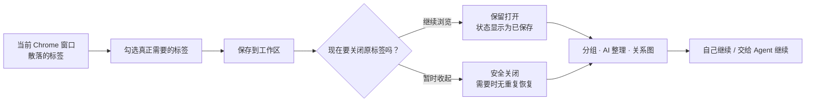
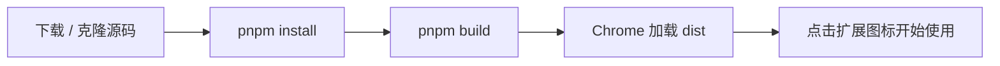
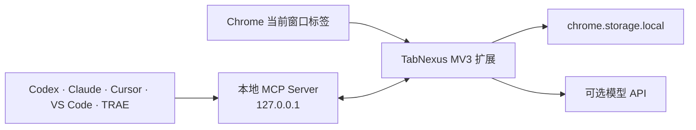

<div align="center">
  
  <h1>TabNexus</h1>
  <p><strong>把不敢关掉的几十个标签，变成一个随时能继续的工作现场。</strong></p>
  <p>一款本地优先的 Chrome 工作区：保存浏览上下文、按你的意图整理，并把它交给 AI Agent 继续处理。</p>

  <p>
    <a href="#立即安装">立即安装</a> ·
    <a href="#第一次使用">第一次使用</a> ·
    <a href="#三个核心收益">核心收益</a> ·
    <a href="#连接-ai-agent">Agent MCP</a> ·
    <a href="docs/README.en.md">English</a>
  </p>

  <p>
    
    
    
    
    
  </p>
</div>


> [!IMPORTANT]
> **当前是 v0.17.0 开发者预览版。** 它是 Chrome 扩展，不是网页。现在需要从源码构建后，在 `chrome://extensions` 中加载 `dist` 文件夹；Chrome 应用商店版本尚未发布。完整步骤见下方[「立即安装」](#立即安装)。

## 你可能不是标签太多，而是有太多事情还没有做完

早上查一份行业报告，顺手打开竞品、论文和两个数据源；中午切去排查线上问题，文档、Issue、日志又铺满一排；晚上准备旅行，机票、签证、酒店和攻略混在同一个窗口里。

每个标签都像给未来自己的一个承诺：**“这个还有用，先别关。”**

于是你不敢关闭它们。可当标签多到只剩下一排图标时，你也已经记不起：

- 为什么打开这个页面；
- 它属于哪一件事；
- 哪些已经读过，哪些才是真正的结论；
- 关闭后，下次要怎样恢复刚才的思路。

浏览器记住了页面，却没有记住你正在做的工作。真正让人疲惫的不是标签数量，而是每次回来都要重新拼起上下文。


**TabNexus 解决的不是“把标签藏起来”，而是让未完成的工作可以安全暂停、清晰恢复，并继续流动。**

| 使用前 | 使用 TabNexus 后 |
|---|---|
| 不敢关标签，怕以后找不到 | 保存状态清楚可见，确认后放心关闭 |
| 重新打开一堆 URL，仍不知道先做什么 | 分组、备注、阅读状态与关系一起恢复 |
| AI 每次都要重新解释背景并粘贴链接 | Agent 直接读取同一个本地工作区继续执行 |
| 固定主题分类不符合当下任务 | 按类型、时间、阶段、优先级或任意意图整理 |

## 30 秒看懂 TabNexus



右侧「标签操作台」始终显示当前窗口，并区分：**未保存且打开、已保存且打开、已保存但已关闭、已关闭且未保存**。保存和关闭是两个明确动作；固定标签不会被批量关闭。

## 立即安装

### 开始前需要什么

- Google Chrome 118 或更高版本
- Node.js 22 或更高版本
- 约 3–5 分钟

### 方式一：下载源码（第一次使用推荐）

1. 点击仓库右上角绿色 **Code** 按钮，再点 **Download ZIP**；也可以[直接下载当前源码](https://github.com/KaichenCurry/TabNexus/archive/refs/heads/main.zip)。
2. 解压文件，进入 `TabNexus-main` 文件夹。
3. 在该文件夹打开终端：
   - macOS：Finder 右键文件夹 →「新建位于文件夹位置的终端窗口」。
   - Windows：在文件夹地址栏输入 `powershell` 并回车。
4. 复制并依次运行：

```bash
corepack enable
corepack prepare pnpm@11.9.0 --activate
pnpm install --frozen-lockfile
pnpm build
```

如果系统提示没有 `corepack`，先运行 `npm install -g pnpm@11.9.0`，再执行最后两条命令。

### 方式二：Git 克隆（开发者）

```bash
git clone https://github.com/KaichenCurry/TabNexus.git
cd TabNexus
corepack enable
pnpm install --frozen-lockfile
pnpm build
```

### 加载到 Chrome

1. 在 Chrome 地址栏打开 `chrome://extensions`。
2. 打开右上角 **开发者模式**。
3. 点击 **加载已解压的扩展程序**。
4. 选择刚刚生成的 `TabNexus/dist` 文件夹——不是项目根目录。
5. 在浏览器工具栏固定 TabNexus，然后点击图标。



> 使用本地 `file://...html` 页面时，请在扩展详情中开启「允许访问文件网址」。TabNexus 不会替换新标签页，也不使用 Side Panel。

## 第一次使用

1. **先选，不必全收。** 在右侧标签操作台勾选这次任务真正需要的标签；「全选」会自动跳过固定标签。
2. **点击保存。** 标签立即进入当前工作区，原网页默认继续保持打开；已保存状态会显示在标签旁。
3. **需要安静时再关闭。** 选中标签后点击「关闭」，或在设置里开启「保存后关闭」。关闭不会删除工作区卡片。
4. **建立工作结构。** 手动拖入分组、输入一句话让 AI 按你的规则整理，或切换到关系图梳理关联。
5. **随时恢复。** 打开单张卡片、一个分组或整个工作区；已经打开的 URL 不会重复创建。

## 三个核心收益

### 1. 放心关闭，但不会丢掉工作现场

TabNexus 保存的不只是一串 URL。分组、顺序、备注、阅读状态和页面关系都会留在工作区中；Chrome 或扩展重启后仍能继续。你可以恢复一张卡片、一个分组或整个工作区，已有页面会自动跳过。

**得到的不是更干净的标签栏，而是一种“现在可以安全停下来”的确定感。**


### 2. AI 按你的意图整理，而不是替你做主

选择整个工作区，或只选择右侧勾选的标签，然后告诉 AI：

- 按网页类型分类；
- 按最近访问时间分类；
- 按任务阶段整理；
- 或使用你自己的规则。

TabNexus 会先给出操作预览和分类依据，你可以修改分组与归属，再决定是否应用。DeepSeek、OpenAI、Claude、Kimi、通义千问和 MiniMax 都是可选能力；没有 API Key 时仍可使用本地域名整理。

**结构跟随你的任务，而不是把所有工作强行塞回“主题文件夹”。**


### 3. 不只收藏页面，还能看见它们之间的关系

同一批资料可以切换到 Obsidian 风格的无限画布。卡片支持框选、多选、拖动、缩放、自动排版和自定义连线；位置与关系会持久保存。

**当任务不是线性的列表时，你仍能看清“证据、结论和下一步”如何连接。**


## 连接 AI Agent

TabNexus 还可以成为 Codex、Claude、Cursor、VS Code 和 TRAE 的本地上下文层。Agent 不需要你反复粘贴 URL，可以通过 MCP 搜索工作区、整理资料、修改分组与关系图、保存或恢复标签。


| 客户端 | 本地支持 | 接入方式 |
|---|---:|---|
| Codex | ✅ | 仓库插件包 |
| Claude Desktop | ✅ | 自包含 `.mcpb` 扩展包 |
| Claude Code | ✅ | 仓库 Marketplace 插件 |
| Cursor | ✅ | 标准本地 MCP 配置 |
| VS Code / Copilot Agent | ✅ | VS Code MCP 配置 |
| TRAE Work | ✅ | 标准本地 MCP 配置 |
| 扣子 Coze | 规划中 | 需要独立鉴权的远程 MCP 网关 |

本地 MCP 提供 **17 个工具**，覆盖工作区、分组、卡片、关系图、标签选择、保存、恢复、导出以及带确认保护的关闭和删除。多 Agent 可同时连接；写入使用 revision 和幂等操作 ID，避免旧会话静默覆盖新内容。

安装扩展后，打开 **设置 → 连接你常用的 Agent**，选择客户端并按页面提示操作。详细资料见[客户端适配说明](docs/AGENT_CLIENT_ADAPTERS.md)、[能力矩阵](docs/MCP_CAPABILITY_MATRIX.md)和[测试指南](docs/MCP_TESTING.md)。

## 隐私与安全

- 工作区与模型密钥保存在 Chrome 本地存储；没有 TabNexus 账号和云端数据库。
- 不使用内容脚本、`<all_urls>`、`webRequest`、`downloads` 或新标签页劫持。
- AI 只在你主动整理时发送必要的卡片 ID、标题和 URL；不会发送备注和密钥。
- MCP 只监听 `127.0.0.1`，不会向 Agent 暴露模型密钥。
- 导出不会包含设置、凭据或临时 Chrome tabId。
- 固定标签可以手动保存，但无法通过批量操作或 MCP 关闭。

发现安全问题时，请阅读[安全策略](.github/SECURITY.md)并使用 GitHub 私密漏洞报告。不要在 Issue、截图、fixture 或导出中粘贴真实 API Key。

## 开发与验证

```bash
pnpm dev                  # 使用脱敏模拟标签预览真实 UI
pnpm typecheck
pnpm test                 # 单元、组件、Manifest 与 Chrome API 测试
pnpm test:e2e             # Chrome for Testing 扩展端到端测试
pnpm check                # 类型、测试、MCP 合约与生产构建
pnpm mcp:test             # 通过真实 stdio 进程验证全部 17 个工具
pnpm eval:mcp:validate    # 校验 600 条 MCP 评测数据集
```

当前自动化基线：**106 项测试、17/17 MCP 工具、36/36 项确定性能力检查**。

<details>
<summary><strong>仓库结构</strong></summary>

```text
agent/   MCP bridge、客户端适配与 Agent 插件
docs/    产品、实现、测试与公开文档
public/  Chrome Manifest、图标与发布资源
scripts/ 构建、安装、审计与评测脚本
src/     React 工作区、设置页、数据与 Chrome 服务逻辑
tests/   单元、组件、E2E、fixtures 与 MCP 评测集
```

根目录只保留构建配置、许可证、变更日志和项目入口；历史 PRD 已归档到 [`docs/product/PRD.md`](docs/product/PRD.md)。
</details>

## 技术架构



技术栈：React、TypeScript、Vite、Vitest、Playwright、Chrome Manifest V3、Model Context Protocol。所有运行时代码与字体随扩展打包，不执行远程托管代码。

## 项目状态

已经实现：

- 多工作区标签保存、去重、关闭、恢复、过滤、拖拽、备注、状态与导出；
- 按用户意图进行的多模型 AI 整理与可编辑预览；
- 可持久化布局与连线的无限关系画布；
- 覆盖工作区和标签操作台的本地多 Agent MCP；
- 中文主界面与英文界面。

接下来：

- 不需要源码构建的公开安装包；
- Chrome Web Store 上架；
- 面向扣子等云端 Agent 的鉴权远程 MCP；
- 更完整的无障碍、快捷键与大型工作区性能验证。

完整进度见[实现状态](docs/IMPLEMENTATION_STATUS.md)。

## 参与贡献

欢迎提交体验反馈、文档改进、模型适配、无障碍优化与聚焦的 Pull Request。开始前请阅读[贡献指南](.github/CONTRIBUTING.md)与[社区行为准则](.github/CODE_OF_CONDUCT.md)。

## License

TabNexus 使用 [MIT License](LICENSE)。

---

<div align="center">
  <strong>浏览器保存了页面。TabNexus 保存你为什么打开它们，以及接下来要做什么。</strong>
</div>
