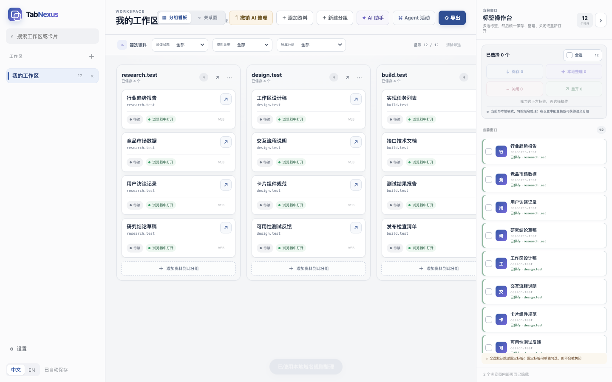

  
  <h1>TabNexus</h1>
  
<strong>你开的不是标签页，是一件还没做完的事。 TabNexus 把散乱 Tabs 变成你和 AI 都能接着用的任务上下文。</strong>

  
本地整理开箱即用 · 配置 AI API 后按意图升级 · 需要时再接入 MCP Agent

  

    <a href="#why">为什么</a> ·
    <a href="#what">它是什么</a> ·
    <a href="#features">完整工作流</a> ·
    <a href="#ai-api">AI API</a> ·
    <a href="#agent">Agent 协作</a> ·
    <a href="#start">两分钟上手</a> ·
    <a href="docs/INSTALL_CHROME.md">Chrome 安装</a> ·
    <a href="docs/INSTALL_DSH.md">DSH 安装</a> ·
    <a href="docs/README.en.md">English</a>
  

  

    
    
    
    
    
    
  

<picture></picture>

把网页保存成带分组、备注、状态和关系的 Workspace。原标签放心关掉，需要时一键恢复。

> [!IMPORTANT]
> **当前版本为 v2.0.0（本地重构版）。** 产品已整体重构为「任务上下文文档」：任务头+进度条、自由章节、AI 一键整理、AI 总结、简单关系图、收件口与 Agent Handoff；DSH 插件生态 Agent（Preset + Skill + MCP 直连）已交付。Chrome Web Store 版本尚未发布。→ [两分钟上手](#start)

## 😵 你不敢关的不是 Tab，而是那件还没做完的事

你的浏览器里，也许正躺着一件你不敢结束的事。

最初只是想调研一家公司、比较几个方案，或排查一个 Bug。一个页面带出下一条线索，不知不觉就变成二十多个 Tab。你知道有些是背景、有些是证据、有些互相矛盾，还有几页没看完——但浏览器只看见二十个 URL。

**一个 Tab 只是一条线索；一组 Tab，本该是一份正在形成的判断。** 可它们为什么在一起、各自有什么作用、任务走到了哪一步，全都只存在你的脑子里。第二天回来，网页还在，思路却已经断了。

你舍不得关掉的，从来不是页面，而是那段尚未完成的思考。

<picture></picture>

Toby、OneTab、Workona 等传统工具解决了“页面太多放哪里”，却很难保留“我为什么打开它们”。到了 AI 时代，这个断层更加明显：为了让 AI 接手，你仍要逐条复制链接、重新解释背景，或者让 Computer Use / Playwright 逐页读取浏览器。你成了浏览器和 AI 之间的“人肉 API”。

这不是你不会整理，而是浏览器从来没有替你保存任务背后的“为什么”。

> [!IMPORTANT]
> **TabNexus 的出发点只有一句：别再把 Tab 当 Tab 管，把它当任务上下文。**

## ✨ TabNexus：把 Tabs 变成可继续的任务上下文

TabNexus 不是又一个把链接塞进文件夹的 Tab Manager。它想在浏览器与最终产出之间，补上一层长期缺失的东西：**任务上下文**。

普通 Tab Manager 的终点是“以后还能打开”；TabNexus 的起点是“回来就知道为什么打开、做到哪里、下一步是什么”。

~~~mermaid
flowchart LR
    Intent["🎯 想完成一件事"] --> Tabs["📑 打开 Tabs"]
    Tabs --> Workspace["📦 本地 Workspace 保存 · 恢复 · 本地整理"]
    Workspace --> Thinking["🧠 任务思路 卡片 · 关系 · 进度"]
    Thinking --> Output["✅ 产出 判断 · 报告 · 下一步"]
    API["✨ AI API 配置后按意图整理"] -. "提出结构" .-> Thinking
    Agent["🤖 MCP Agent 可选进阶协作"] <-->|读取 · 补充 · 写回| Workspace
~~~

Workspace 不是一个网页仓库，而是一件任务的现场：它保留页面的角色、彼此的关系和推进状态。你可以停在本地保存与梳理，也可以配置 AI API 帮你按意图重组；当任务还要继续研究、写作或编码时，再把同一份上下文交给 Agent。

**这不是几个互不相关的功能。保存不是终点，Agent 也不是起点；每一步都在丰富同一份 Workspace，让下一步不必从头开始。**

## 🧩 同一份上下文，四步从“页面堆积”走向“任务推进”

前两步构成完整的本地工作流：先让任务安全留下，再把思路理清；AI API 是可选增强，MCP Agent 是更进一步的协作方式。

### 1️⃣ 任务文档：把 Tabs 收成一份会生长的文档

首启只问一句「**这次你想搞清楚什么？**」。从收件口勾选当前窗口的页面 →「收进任务」——它们变成文档里的引用条目。任务头常驻：目标、下一步、**分段式进度条**（一段=一个章节，填充=阅读进度，⭐=已采用）。

日常底座永远可用：保存当前页 ≤2 次点击、一键保存窗口、保存并关闭（固定标签永不批量关闭）、恢复、删除确认、最近关闭找回、URL 去重——**零 AI 依赖**。

### 2️⃣ 整理与推进：自由章节 + 四态 + 简单关系图

- **自由章节**：按你的思路建章节、拖页入章、AI 建议结构（可编辑预览），不强制任何固定分类法；
- **四态推进**：待读 / 已读 / 已采用 / 已排除（排除必填原因——"为什么不要"是一等公民），备注直接显示在条目正面；
- **简单关系图**：章节泳道 + 页面节点 + 带标签箭头，点击节点打开原页；关系数据由你或 Agent 维护（propose_structure）；
- **结论区**：固定文档尾部，写一句话结论 = 任务可交付；进度条涨满自动高亮「让 Agent 继续」。

### 3️⃣ AI 一键整理与 AI 总结

**✦ AI 一键整理**（四模式，全部先预览后应用、可撤销）：
- 按内容理解（AI 语义分组 + 逐条理由）
- 按时间（今天 / 本周 / 更早，纯本地）
- 按域名（纯本地，你主动选择，绝非默认）
- 自定义提示词（如"按背景、证据、反例、结论"）

**AI 总结**：一键把当前任务（仅标题/URL/备注/状态，**永不发送网页正文**）总结为结构化摘要，写入结论区，可继续编辑。

> [!IMPORTANT]
> 未配置 AI 时系统保持本地模式（按时间/按域名照常可用），不会调用外部服务。支持 DeepSeek、OpenAI、Claude、Kimi、通义千问和 MiniMax。

### 4️⃣ Agent 协作与 DSH 插件生态

点「**让 Agent 继续**」：一键生成 **Context Packet**（目标、章节、页面、备注、状态、排除原因、下一步、结论——明示"不会提供：网页正文、API Key、其他任务"），复制进 DSH / Codex / Claude，Agent 从你停下的地方继续，并把结论、补页与结构建议写回任务（版本校验 + 幂等 + 破坏性确认 + 活动留痕）。

**DSH 插件生态 Agent 已交付**：`dsh plugin add` 一条命令装好 `dsh-plugin-tabnexus`（17 个 `mcp__tabnexus__*` 工具 + 界面内快速面板 + **「⛶ 全屏」全局工作区**——与 Chrome 插件同款：任务头/进度/章节/页面操作 + 收件口），任何 DSH 会话即成为 Tab Agent。注意：DSH 插件需要 Chrome 扩展作为浏览器操作层（采集/存储/开关标签）。完整安装教程见 [DSH 安装教程](docs/INSTALL_DSH.md)。

> **「一切皆插件 —— 那浏览器里那 50 个 Tab，也该是。」** 诚邀全球 Harness 开发者共建 DSH 插件生态。接入指南见 [agent/dsh/README.md](agent/dsh/README.md) 与 [agent/dsh/VERIFICATION.md](agent/dsh/VERIFICATION.md)。

## 🚀 两分钟安装，并完成第一次整理

1. **安装扩展：** 下载并解压 [TabNexus Chrome v2.0.0](https://github.com/KaichenCurry/TabNexus/releases/download/v2.0.0/TabNexus-Chrome-v2.0.0.zip)，打开 <code>chrome://extensions</code>，开启**开发者模式**并选择**加载已解压的扩展程序**。完整图文教程见 [Chrome 安装教程](docs/INSTALL_CHROME.md)。
2. **保存一个任务：** 打开 TabNexus，勾选属于同一任务的网页并点击**保存**。现在可以放心关闭原标签。
3. **选择整理方式：** 系统默认在本地整理；需要 AI 时，先在设置中选择服务商、填写 API Key 并启用，再输入自己的整理意图。
4. **继续推进：** 在看板或关系图中标记进度，需要时恢复卡片、分组或整个 Workspace。

到这里已经可以完整使用 TabNexus——**不需要 Agent，也不需要终端。**

<strong>从源码构建</strong>

需要 Node.js 22.13+ 与 pnpm 11。若尚未安装 pnpm，可先运行 <code>npm install --global pnpm@11.9.0</code>。

~~~bash
git clone https://github.com/KaichenCurry/TabNexus.git
cd TabNexus
pnpm install --frozen-lockfile
pnpm build
~~~

然后在 <code>chrome://extensions</code> 中加载生成的 <code>dist</code> 目录。

## 🔌 连接 Agent（可选进阶）

打开**设置 → 连接你常用的 Agent**。本地 MCP 提供 **17 个聚焦工具**，覆盖 Workspace、卡片、关系图、导出与标签操作。

**不需要源码：**先完成上方两分钟扩展安装，再在首次教程的第三步或**设置 → 连接你常用的 Agent**中选择客户端。Codex 会下载一个只需打开一次的 macOS 安装器，它自动添加 TabNexus Marketplace、安装插件并打开 Codex，不需要终端或输入 Query；TRAE Work CN 进入 MCP 导入窗口，Claude Desktop 下载可双击安装的扩展包。Cursor、VS Code 与 TRAE Work CN 首次启动本地 MCP 时需要已安装 Node.js 22.13+。

<strong>已支持的客户端与技术文档</strong>

| 客户端 | 状态 | 接入方式 |
|---|:---:|---|
| Codex | ✅ | 下载并打开一次 macOS 一键安装器 |
| Claude Desktop | ✅ | 两分钟包内置 MCPB |
| Cursor / VS Code / TRAE Work CN | ✅ | 打开客户端一键安装 / 导入 |
| 扣子 Coze | 规划中 | 鉴权远程 MCP 网关 |

[客户端适配说明](docs/AGENT_CLIENT_ADAPTERS.md) · [能力矩阵](docs/MCP_CAPABILITY_MATRIX.md) · [测试指南](docs/MCP_TESTING.md)

## 🔒 本地优先，边界清晰

- TabNexus 无账号、无自建云端；Workspace 和模型 Key 保存在 Chrome 本地存储；
- 只有主动调用 AI 时，用户指令和必要的任务元数据才会发往所选模型服务；不发送网页正文或卡片备注，API Key 仅用于该服务的请求鉴权；
- MCP 只监听 <code>127.0.0.1</code>，不会向 Agent 暴露模型 Key；启用后应只连接可信的本机 Agent，不使用时可在设置中断开；
- 不使用内容脚本、<code>&lt;all_urls&gt;</code>、<code>webRequest</code>、下载权限或新标签页劫持；
- 关闭、删除等破坏性操作需要明确确认，导出不含凭据。

发现安全问题请阅读[安全策略](.github/SECURITY.md)，并使用 GitHub 私密漏洞报告。

## 🛠️ 已实现与下一步

**v2.0.0 已实现（2026-08 全量重构）：**任务上下文文档（任务头+分段进度条 / 自由章节 / 四态引用块 / 结论区）、收件口与工具栏 Popup、⌘K 命令面板、日常底座（采集/恢复/删除/最近关闭/去重，零 AI 依赖）、AI 一键整理四模式与 AI 总结（预览→应用→撤销）、简单关系图（纯 SVG）、Context Packet v2 与 Agent Handoff、17 工具本地 MCP（v2 元数据与排除原因已流入 read_workspace / edit_workspace）、**DSH 插件生态 Agent**（`tabnexus-research` 预设 + `tabnexus` 技能 + MCP 直连配置，已安装到本机 DSH 并完成 7 项自动化验证）。

**接下来：**会话级验收（见 [agent/dsh/VERIFICATION.md](agent/dsh/VERIFICATION.md)）、Chrome Web Store 上架、面向云端 Agent 的鉴权远程 MCP、无障碍与大型任务性能。设计基线见 [BLUEPRINT](docs/product/BLUEPRINT.md)，执行清单见 [ACTION-ITEMS](docs/product/ACTION-ITEMS.md)。

技术栈：React · TypeScript · Vite · Vitest · Playwright · Chrome Manifest V3 · Model Context Protocol。

## 🌱 一起构建浏览器与 Agent 之间的上下文层

浏览器上下文既私人又关键，所以数据边界应该可检查、Agent 接口应该可扩展，产品方向也应该由真正被标签困扰的人共同塑造。

- 🐛 提交 [Issue](https://github.com/KaichenCurry/TabNexus/issues/new/choose)
- 💬 加入 [Discussions](https://github.com/KaichenCurry/TabNexus/discussions)
- 🔧 阅读[贡献指南](.github/CONTRIBUTING.md)
- 📮 联系：[currykchen@hotmail.com](mailto:currykchen@hotmail.com)

## 📄 License

[MIT](LICENSE)

---

  <strong>浏览器记得你打开了什么。 TabNexus 记得你为什么打开、做到了哪里，以及接下来由谁继续。</strong>

