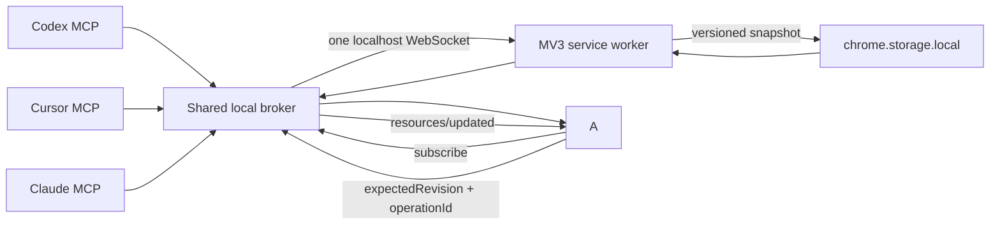

# TabNexus M3 Agent bridge — phase 2.8

Status: versioned, subscribable multi-Agent local context loop implemented

The bridge keeps one validated internal request envelope between transport and product logic:

```json
{
  "type": "M3_AGENT_TOOL",
  "workspaceId": "optional-workspace-id",
  "payload": { "tool": "read_workspace" }
}
```

The MV3 service worker resolves the requested (or active) workspace from versioned local storage, executes the tool, and persists only validated mutations. Settings and built-in model API keys are never part of tool input or output. The MCP server never invokes a built-in model.

## Context flow



1. `resources/list` exposes every Workspace as `tabnexus://workspace/{workspaceId}`, supported tabs as `tabnexus://browser/current-window`, and the user-visible selection/rail/recovery state as `tabnexus://workbench/current`.
2. A Workspace resource returns compact card/group/relationship metadata without card notes.
3. Full notes are read only through the `tabnexus://workspace/{workspaceId}/card/{cardId}` resource template or a card-scoped full tool read.
4. Every read returns a deterministic Workspace `revision`. `sinceRevision` returns `unchanged: true` without resending context.
5. Subscribed MCP clients receive `notifications/resources/updated` after Agent writes, user Workspace edits, or live tab changes are detected.
6. Mutating calls accept `expectedRevision`; stale writes fail and require a fresh read.
7. Mutating calls accept `operationId`; successful receipts are reused on retry so an Agent does not duplicate a report or card after a timeout.
8. The first local MCP process becomes the broker leader; later Agent processes register as followers and relay through it. Requests retain `agentName` for activity attribution.
9. Chrome serializes collaboration tool execution. If two Agents write from the same revision, the first succeeds and the second receives a revision conflict instead of overwriting data.

## Available tools

- `read_workspace`: returns a versioned summary by default, a conditional `unchanged` response, or selected full card data on demand.
- `search_cards`: searches across selected or all workspaces with group/status/type/source filters; notes are opt-in.
- `add_card`: adds a URL or note with `source: "agent"`; normalized duplicate URLs are not inserted twice.
- `add_cards`: adds up to 100 sources, notes, or reports atomically and reports duplicates.
- `write_report`: writes Agent output as a `report` card with `source: "agent"`.
- `propose_structure`: validates referenced card IDs and returns a non-destructive relationship proposal for later human review.
- `edit_workspace`: atomically renames workspaces/groups, creates groups, moves/reorders cards, updates card metadata/status, changes group order, positions cards on the mind-map, and edits relationships without deleting data.
- `manage_workspaces`: creates, selects, renames, reorders, or duplicates workspaces using an app-level revision.
- `delete_workspace_items`: the only saved-data deletion tool; explicitly deletes cards, groups, or a workspace using fresh revisions and `confirm: true`.
- `read_tab_workbench`: returns the right-side operation area exactly as the user sees it, including checkbox selection, open/saved/recovery states, collapsed state, and a workbench revision.
- `manage_tab_workbench`: changes selection, selects all by state, collapses/expands the rail, focuses a current tab, or reopens recently closed unsaved tabs.
- `dismiss_recent_tabs`: permanently removes selected recovery entries using a fresh workbench revision and `confirm: true`.
- `sync_browser_tabs`: saves selected current-window tabs, reopens saved cards, or focuses a saved card without closing anything; save/open can consume the shared workbench selection.
- `close_browser_tabs`: saves first by default, closes only selected supported non-pinned tabs, can consume the shared workbench selection, and requires `confirm: true`.
- `export_workspace`: returns deterministic Markdown or JSON without settings, credentials, or ephemeral tab IDs.
- `manage_preferences`: reads or updates safe display and behavior settings while keeping every provider key private.
- `manage_agent_activity`: reads or explicitly clears local Agent activity using an independent revision and confirmation guard.

`sync_browser_tabs` additionally restores an entire group or workspace and can save the complete current window. `close_browser_tabs` can act on the complete current window while still protecting pinned tabs.

The server also exposes `organize_workspace`, `capture_tabs`, `operate_tab_workbench`, and `workspace_audit` prompts, plus versioned workspace and workbench resources.

JSON-schema-compatible definitions live in `extension/src/core/collaboration.ts` as `COLLABORATION_TOOL_DEFINITIONS`. The MCP-facing definitions also include `outputSchema` and read-only/destructive/idempotency annotations.

## DeepSeek and MCP Agent responsibilities

They are complementary and never run as a hidden two-model chain:

| Capability | Built-in AI model | External MCP Agent |
|---|---|---|
| Fast tab/workspace classification | Primary path | Not called automatically |
| Operate the exact right-rail selection | Primary path | Complete through shared versioned workbench state |
| Long research and multi-app work | Not used | Primary path |
| Read notes and relationship context | Only for explicit in-product features | On-demand MCP resources |
| Add sources / write reports | Not used | Validated write tools |
| Model/API cost | One explicit in-product request | Controlled by the user's Agent client |

If an external Agent can classify well, the built-in provider remains optional. Keeping it provides a zero-setup, fast in-product organizer when no MCP client is running. TabNexus does not send one request to both systems.

## Trust and mutation rules

- The MCP process binds only to `127.0.0.1:43119`; it is not reachable from the LAN or internet.
- WebSocket upgrades accept Chrome extension origins and reject ordinary webpage origins.
- The loopback transport is a trust boundary, not authentication between processes on the same computer. Connect only trusted local Agent clients and disconnect the bridge when it is not in use.
- A requested workspace ID must already exist.
- URL, group, card, and edge references are validated before any write.
- Workspace/card deletion and browser-tab closing require explicit confirmation. Deleting a group safely returns its cards to the ungrouped area; pinned browser tabs are never closed.
- `propose_structure` does not apply relationships automatically; it appears in Agent Activity and opens the existing human review dialog.
- Revision conflicts fail closed; Agent retries must re-read context.
- Operation receipts are retained in a separate bounded local store for retry deduplication; clearing the visible Agent activity history does not remove them.
- The extension requests no `nativeMessaging` permission and installs no Chrome native host.
- Agent clients own their MCP process lifetimes. Several processes may share the same broker; active clients expire automatically after they close.
- Disconnecting in TabNexus immediately closes the WebSocket; the bridge is never required for normal TabNexus use.

## Transport components

- `agent/bridge/tabnexus-mcp.mjs`: dependency-free MCP JSON-RPC stdio server plus loopback-only WebSocket relay.
- `agent/integrations/claude/manifest.json`: self-contained Claude Desktop MCPB metadata.
- `agent/integrations/claude-code/`: Claude Code plugin with a bundled MCP definition.
- `agent/plugins/tabnexus/`: Codex marketplace plugin with the same bundled MCP server.
- `extension/src/core/agentClients.ts`: shared adapter definitions and official Cursor, VS Code, and TRAE install-link generation.
- `scripts/build-agent-packages.mjs`: reproducible dependency-free MCPB packager.
- `extension/src/background.ts`: Agent connection manager, WebSocket keepalive, tool execution, persistence, and activity logging.
- `extension/src/workspace/WorkspaceModals.tsx`: live Agent activity and relationship-proposal review.

## Remaining M3 hardening

1. Publish the MCP server as a stable package/binary so Cursor, VS Code, and TRAE configs do not contain a source-checkout path.
2. Publish the Codex and Claude Code marketplaces, then submit the Claude MCPB and MCP server to their in-app directories/registries.
3. Add pairing secrets and optional per-tool approval policies before broader write capabilities are introduced.
4. Add an authenticated Streamable HTTP gateway before enabling Coze or any cloud-only Agent.
5. Replace the current two-second subscription check with direct storage-change push if profiling shows material idle overhead during long Agent sessions.
