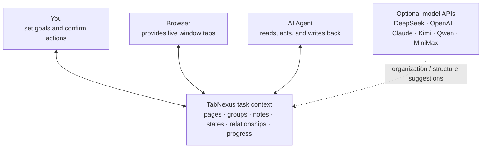
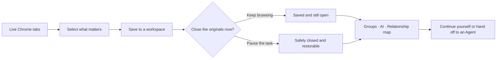
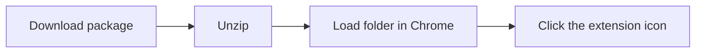
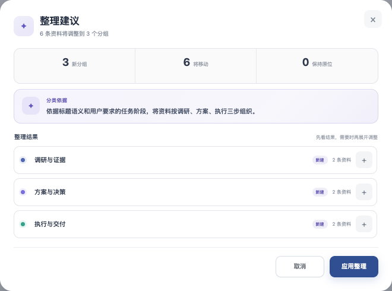
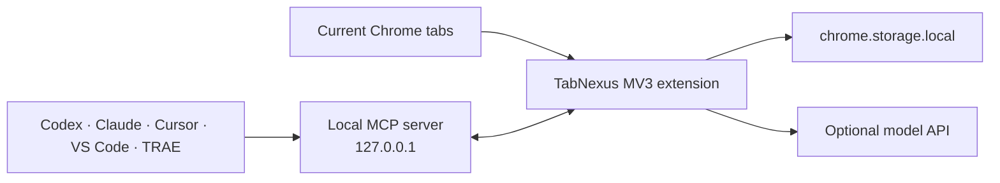

<div align="center">
  
  <h1>TabNexus</h1>
  <p><strong>A web-tab workbench where you, your browser, and AI Agents share the same task context.</strong></p>
  <p>Turn the tabs you are afraid to close into work that can be saved, understood, resumed, and handed off.</p>

  <p>
    <a href="#install">Install</a> ·
    <a href="#core">Core layers</a> ·
    <a href="#agent">Agent MCP</a> ·
    <a href="../README.md">简体中文</a>
  </p>
</div>

<picture></picture>

> [!IMPORTANT]
> **v0.17.0 is a developer preview.** A two-minute Chrome package is available—no Node, pnpm, or terminal required. A Chrome Web Store build is not available yet.

## 😵 Tabs you cannot close

Research in the morning, an incident at noon, and trip planning at night. Every context switch leaves another batch of “read this later” pages behind.

Every tab becomes a promise to your future self: **“This still matters. Do not close it yet.”**

- 🔎 Why did I open this page?
- 🧩 Which task does it belong to?
- ✅ What have I read, and what is the actual conclusion?
- 🔁 If I close it, where do I restart?

The browser remembers pages, but not the story of the task. The exhausting part is not the tab count—it is rebuilding context every time you return.

<picture></picture>

**TabNexus does not merely hide tabs. It makes unfinished work safe to pause, clear to resume, and easy to hand off.**

## ✨ Before and after

These are **real extension screenshots from the same run**. The same 12 sanitized pages start as loose, unsaved tabs and end as three resumable working groups. They are not static mockups.

| 😵 Before — pages exist, but task structure does not | ✨ After — context is saved and keeps moving |
|---|---|
| <picture></picture> | <picture></picture> |

| Before | With TabNexus |
|---|---|
| Closing a tab feels like losing both the page and the thought | Save and close are separate, so the state is visible before anything disappears |
| Restoring URLs still means reconstructing the task | Groups, notes, states, relationships, and progress return together |
| Every AI chat starts with the same background and links | An Agent reads the same local workspace and writes results back |

## 🧩 Shared context

TabNexus is not another bookmark manager. It lets **you, the live browser window, and AI Agents work against the same task context**. Model APIs are optional assistants: they interpret organization intent and suggest task structure, while every consequential change remains previewable and user-controlled.



## ⚡ In 30 seconds



The right-side tab workbench distinguishes unsaved and open, saved and open, saved but closed, and closed without being saved. Saving and closing are separate, explicit actions. Pinned tabs are never closed in bulk.

<a id="install"></a>
## 🚀 Two-minute install

**No terminal or developer tools. This usually takes less than two minutes.**

1. **[Download the TabNexus Chrome package](https://github.com/KaichenCurry/TabNexus/releases/download/v0.17.0/TabNexus-Chrome-v0.17.0.zip)** and unzip it.
2. Open `chrome://extensions` and enable **Developer mode**.
3. Click **Load unpacked** and select the extracted `TabNexus-Chrome-v0.17.0` folder.
4. Pin TabNexus and click its toolbar icon.



To update, download the new package, remove the old unpacked extension, and load the new folder. For local `file://...html` pages, enable **Allow access to file URLs** in the extension details.

<details>
<summary><strong>Developers: build from source</strong></summary>

```bash
git clone https://github.com/KaichenCurry/TabNexus.git
cd TabNexus
corepack enable
pnpm install --frozen-lockfile
pnpm build
```

Load the generated `dist` folder. The source build is intended for development, tests, and local Agent connections such as Codex, Cursor, VS Code, and TRAE.
</details>

<a id="first-use"></a>
## 👋 First use

1. **Select, rather than capture everything.** Check the tabs that belong to the task; Select all skips pinned tabs by default.
2. **Save them.** They enter the active workspace while the original pages remain open by default.
3. **Close only when you choose.** Closing a browser tab does not delete its workspace card.
4. **Build the structure.** Drag cards into groups, describe a grouping rule to AI, or use the relationship map.
5. **Resume without duplicates.** Open one card, one group, or the whole workspace; URLs already open are skipped.

<a id="core"></a>
## 🧱 Three layers

### 1. 🗂️ Tab workspace

Select the live tabs that belong to a task, capture and group them, then explicitly decide whether to close the originals. Workspaces stay isolated, saved state remains visible, and restore skips URLs that are already open.

Organize manually or ask an optional provider such as DeepSeek to classify by page type, recent access time, task stage, priority, or your own instruction. Local domain grouping still works without a key.

**The outcome is not merely a cleaner tab strip. It is knowing the task is safe to pause and easy to resume.**

| Workspace overview | Organize by intent |
|---|---|
| <picture></picture> | <picture></picture> |
| Saved states, grouped cards, and the current browser window stay in one line of sight. | Choose the scope first, then describe your own grouping rule instead of accepting a fixed taxonomy. |

### 2. 🧠 Task thinking

The same material can switch between a card board and an infinite relationship canvas. The board is for grouping, notes, and reading states; the canvas is for evidence, conclusions, dependencies, next steps, and persistent progress.

AI acts as a structure assistant here: it can propose groups, relationships, and task stages from your goal. TabNexus shows the rationale and change preview first, and you can redirect individual pages before applying anything.

**You are no longer managing a URL list. You are managing visible reasoning, relationships, and progress.**

| Infinite relationship map | Change preview |
|---|---|
| <picture></picture> | <picture></picture> |
| Arrange sources, dependencies, and next steps on an infinite canvas; positions and connections persist. | Review the rationale, movement scope, and result first; redirect items before applying anything. |

### 3. 🤝 Agent collaboration

Through MCP, TabNexus becomes a local context layer for Codex, Claude, Cursor, VS Code, and TRAE. An Agent can read the current task and browser tabs, search the workspace, add sources, change groups and relationship layouts, write back reports and task-structure suggestions, and safely save, close, or restore pages behind confirmation guards.

**You stop re-explaining the background, links, and latest progress. The Agent picks up the same continuously updated workspace.**

| Agent connection | Agent write-back |
|---|---|
| <picture></picture> | <picture></picture> |
| Choose the client you already use and follow its shortest setup path; daily work stays inside the Agent conversation. | Reads, new sources, structure changes, and written results remain visible in a clear activity trail. |

<a id="agent"></a>
## 🔌 Connect an Agent

| Client | Local support | Integration |
|---|---:|---|
| Codex | ✅ | Repository plugin package |
| Claude Desktop | ✅ | Self-contained `.mcpb` bundle |
| Claude Code | ✅ | Repository marketplace plugin |
| Cursor | ✅ | Standard local MCP configuration |
| VS Code / Copilot Agent | ✅ | VS Code MCP configuration |
| TRAE Work | ✅ | Standard local MCP configuration |
| Coze | Planned | Requires an authenticated remote MCP gateway |

The local MCP exposes **17 tools** across workspaces, groups, cards, relationship layout, tab selection, capture, restore, export, and guarded destructive actions. Multiple Agents can connect at the same time; revision checks and idempotent operation IDs prevent stale sessions from silently overwriting newer work.

After loading the extension, open **Settings → Connect your Agent**. See the [client adapter guide](AGENT_CLIENT_ADAPTERS.md), [capability matrix](MCP_CAPABILITY_MATRIX.md), and [testing guide](MCP_TESTING.md).

## 🔐 Privacy and security

- Local-first storage; no TabNexus account or cloud database.
- No content scripts, `<all_urls>`, `webRequest`, `downloads`, or new-tab override.
- AI sends only the minimum card IDs, titles, and URLs required for the operation—never notes or provider keys.
- MCP listens only on `127.0.0.1` and never exposes provider keys.
- Exports exclude settings, credentials, and ephemeral Chrome tab IDs.
- Pinned tabs may be saved explicitly but cannot be closed through bulk actions or MCP.

Read the [security policy](../.github/SECURITY.md) before reporting a vulnerability. Never place a real provider key in an issue, screenshot, fixture, or export.

## 🛠️ Development

```bash
pnpm dev                  # preview the real UI with synthetic tabs
pnpm typecheck
pnpm test                 # unit, component, manifest, and Chrome API tests
pnpm test:e2e             # extension E2E in Chrome for Testing
pnpm check                # typecheck, tests, MCP contract, and production build
pnpm mcp:test             # exercise all 17 tools through a real stdio process
pnpm eval:mcp:validate    # validate the curated 600-query MCP dataset
```

Current automated baseline: **106 tests, 17/17 MCP tools, and 36/36 deterministic capability checks**.

<details>
<summary><strong>Repository layout</strong></summary>

```text
agent/   MCP bridge, client adapters, and Agent plugins
docs/    product, implementation, testing, and public documentation
public/  Chrome manifest, icons, and release assets
scripts/ build, install, audit, and evaluation scripts
src/     React workspace, settings, data, and Chrome service logic
tests/   unit, component, E2E, fixtures, and MCP evaluation data
```

The repository root keeps only build configuration, licensing, changelog, and project entry files. The historical PRD is archived at [`docs/product/PRD.md`](product/PRD.md).
</details>

## 🧭 Architecture



Stack: React, TypeScript, Vite, Vitest, Playwright, Chrome Manifest V3, and Model Context Protocol. All runtime code and fonts ship with the extension; no remote-hosted code is executed.

## 🤝 Contributing

Issues, product feedback, documentation improvements, provider adapters, accessibility fixes, and focused pull requests are welcome. Start with the [contributing guide](../.github/CONTRIBUTING.md) and follow the [Code of Conduct](../.github/CODE_OF_CONDUCT.md).

For feature ideas, product feedback, or future improvements, email **[currykchen@hotmail.com](mailto:currykchen@hotmail.com)**.

## License

TabNexus is available under the [MIT License](../LICENSE).

---

<div align="center">
  <strong>Your browser remembers the pages. TabNexus remembers why you opened them and what comes next.</strong>
</div>
