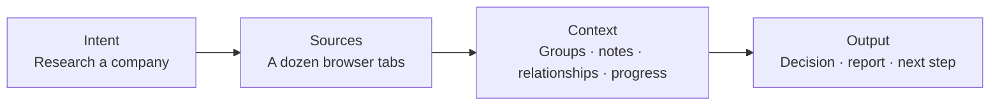
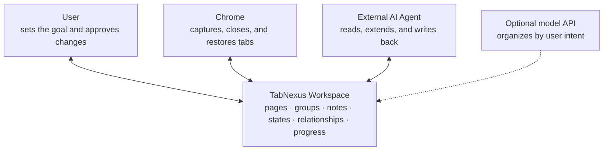
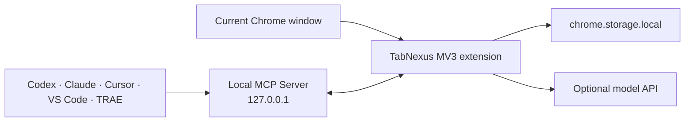

<div align="center">
  
  <h1>TabNexus</h1>
  <p><strong>Turn scattered browser tabs into task context that can be saved, understood, resumed, and handed to an AI Agent.</strong></p>
  <p>A local-first Chrome task workbench for people who research, think, and get work done in the browser.</p>

  <p>
    <a href="#why">Why TabNexus</a> ·
    <a href="#product">Product</a> ·
    <a href="#start">Two-minute start</a> ·
    <a href="#agent">Advanced Agent collaboration</a> ·
    <a href="../README.md">简体中文</a>
  </p>

  <p>
    
    
    
    
    
  </p>
</div>

<picture></picture>

<div align="center"><sub>The same pages are now a Workspace with groups, states, and relationships. Close the originals with confidence and restore them whenever you need them.</sub></div>

> [!IMPORTANT]
> **v0.17.0 is a developer preview.** A loadable Chrome package is available; Chrome Web Store distribution is not available yet.

<a id="why"></a>
## You did not open a tab. You started a task.

Suppose you are researching a company. You begin with a goal, open its product pages, industry reports, competitors, technical posts, and user discussions, then turn those sources into a decision or report.



The browser usually preserves only the strip in the middle. It remembers **what you opened**, but not:

- why those pages were opened or which goal they serve together;
- which are evidence, competitors, conclusions, or next steps;
- how far the task has progressed or where to resume.

Tabs keep accumulating. You are afraid to close them not because every page matters, but because the train of thought around them might disappear too.

<picture></picture>

**TabNexus starts from one idea: a tab is not browser clutter waiting to be filed. It is raw material for task context.**

### Why now?

AI has made this problem more visible. Agents help gather sources, AI output often arrives as web pages, and people switch constantly between browsers and AI tools. Tabs multiply faster while context still lives in human memory.

Products such as Toby, OneTab, and Workona have spent the past decade validating the need to collect and restore tabs. TabNexus takes the next question seriously: **Why were these tabs opened, how do they form a task, and how can a person or Agent continue that task?**

## From tab management to shared task context

TabNexus is not another bookmark folder. It turns an ephemeral browser session into a durable Workspace where the user, Chrome, and AI Agents operate the same structured context.



| Common approach | What it solves | What the user still does |
|---|---|---|
| Bookmarks, tab groups, session saving | Collect pages and restore windows | Reconstruct the goal, structure, and progress |
| Domain-based grouping | Answer “where did this page come from?” | Decide “why did I open it?” |
| Copy every link into an AI chat | Give the model a list of URLs | Act as a human API and explain the background again |
| Computer Use / Playwright over the browser | Operate the live interface | Locate pages one by one and reconstruct the task structure |
| **TabNexus** | Save and organize task context, then expose it through MCP | Set the goal and review consequential changes |

> TabNexus currently gives Agents structured titles, URLs, groups, notes, states, and relationships. It does not scrape page bodies in the background.

## Start with an AI API. Connect an Agent when you need more.

**TabNexus does not require an Agent.** For most people, connecting an AI API is enough to organize tabs by intent, suggest structure, and manage everyday research. Enable MCP Agent collaboration later if you want AI to read the whole Workspace, add sources, or write results back.

| | ① AI organization inside the Workspace | ② External Agent collaboration through MCP |
|---|---|---|
| Best for | Everyone who wants faster tab organization | Agent users who need deeper automation and follow-through |
| Purpose | Turn loose tabs into a structure that follows your intent | Let an Agent pick up that context and continue the work |
| Interaction | Use the Workspace AI assistant to ask: `group these by research stage` or `separate sources from this week` | Read or edit the Workspace directly from Codex, Claude, Cursor, and other Agents |
| Capabilities | Suggest groups, assignments, relationships, and task structure with an editable preview | Search sources, add cards, change structure, write reports, and safely save, restore, or close tabs |
| Model | Optional DeepSeek, OpenAI, Claude, Kimi, Qwen, or MiniMax; local domain grouping works without a key | Uses the Agent's own model; MCP cannot read model keys saved in TabNexus |

Both paths use the same Workspace but work independently: **the AI API is an organization assistant for everyone; Agent collaboration is an advanced capability for users who need it later.**

<a id="product"></a>
## Product

These are not three disconnected features. They are three stages of the same task context: **bring information in, make the thinking clear, and keep the context moving.**

### 1. Tabs and Workspaces: close with confidence, resume without reconstruction

Select the live Chrome tabs that belong to a task, capture and group them in an isolated Workspace, then decide whether to keep the originals open. Saving and closing are separate actions. Closing a browser tab never deletes its card from the Workspace.

- Explicit states for open and unsaved, saved and open, saved but closed, and recently closed without being saved;
- Multiple Workspaces, drag-and-drop groups, notes, filters, deduplication, and Markdown / JSON exports;
- Restore one card, one group, or an entire Workspace without duplicating URLs that are already open;
- Pinned tabs are never closed by bulk operations or Agents.

| Before: pages exist, task structure does not | After: the tabs can close while the context remains |
|---|---|
| <picture></picture> | <picture></picture> |

### 2. Task thinking: keep the relationships and progress, not just the links

The same Workspace can switch between a **card board** and a **flow / relationship-map mode**. The board is for fast grouping, notes, and To read / Read / Adopted progress. The infinite canvas is for evidence, conclusions, dependencies, and next steps; card positions and connections persist.

This is the primary AI path for most users. Connect a DeepSeek, OpenAI, Claude, Kimi, Qwen, or MiniMax API and describe your query and intent: organize by “market / product / technology / finance / opinions,” or by “identify the problem / compare approaches / make a decision.” TabNexus shows the classification basis and change preview before you apply anything. Local domain grouping remains available without an API key.

| Card Workspace | Relationships and task structure |
|---|---|
| <picture></picture> | <picture></picture> |

### 3. Advanced Agent collaboration: stop acting as a human API

When built-in AI organization is no longer enough—for example, when you want an Agent to continue the research, add sources, or write a report—connect local MCP. Codex, Claude, Cursor, VS Code, and TRAE can read the task context you already organized in TabNexus, without asking you to paste a dozen links and retell the goal and latest progress.

An Agent can search Workspaces, add pages or notes, update states and groups, propose relationship structures, write back reports, and operate live tabs behind confirmation guards. Writes use revision checks and activity records so concurrent Agents cannot silently overwrite newer work.

| Connect your Agent | See what the Agent reads and writes back |
|---|---|
| <picture></picture> | <picture></picture> |

## Who is it for?

| If you often… | TabNexus can… |
|---|---|
| Research companies, industries, papers, or competitors | Keep sources, evidence, opinions, and conclusions in one research context |
| Plan products and analyze requirements | Organize references around problems, options, decisions, and progress |
| Do not want to organize everything by domain or a fixed taxonomy | Connect an AI API and classify sources around your own query and intent |
| Build software while reading docs, issues, and implementation examples | Preserve the technical exploration and hand it to a coding Agent |
| Switch frequently between several tasks | Clear browser noise while retaining a restore point for each task |
| Need to give browser research to AI | Replace repeated copy-paste and explanations with one MCP interface |

<a id="start"></a>
## Start in two minutes: install and organize your first task

1. **Install the extension.** Download and unzip the **[TabNexus Chrome package](https://github.com/KaichenCurry/TabNexus/releases/download/v0.17.0/TabNexus-Chrome-v0.17.0.zip)**. Open `chrome://extensions`, enable **Developer mode**, click **Load unpacked**, and select the extracted folder.
2. **Save one task.** Pin and open TabNexus, select related pages in the right-side tab workbench, and click **Save**. The sources now remain in the Workspace even if you close the original tabs.
3. **Organize around your intent.** Drag cards manually, or choose DeepSeek, OpenAI, Claude, Kimi, Qwen, or MiniMax in Settings, enter your API key, and ask the AI assistant: `organize these around my research goal`. Local domain grouping works without a key.
4. **Continue or put the task away.** Track progress in the board or flow / relationship map. Close the original tabs when you want a quieter browser, then restore a card, group, or entire Workspace later.

At this point, TabNexus is fully useful **without an Agent and without Node.js, pnpm, or a terminal**. Connect MCP only when you want an Agent to read the sources, extend the context, or write reports back.

<details>
<summary><strong>Developers: build from source</strong></summary>

Requires Node.js 22+ and pnpm 11.

```bash
git clone https://github.com/KaichenCurry/TabNexus.git
cd TabNexus
corepack enable
pnpm install --frozen-lockfile
pnpm build
```

Load the generated `dist` directory from `chrome://extensions`. Source builds are intended for development, testing, and local Agent connections.
</details>

<a id="agent"></a>
## Advanced: connect an Agent

This is an optional advanced capability. After managing your tabs (the built-in AI API remains optional), open **Settings → Connect your AI assistant** only if you want an Agent to take over the Workspace. Choose a client and follow the in-product steps.

| Client | Current support | Integration |
|---|---:|---|
| Codex | ✅ | Repository plugin package |
| Claude Desktop | ✅ | Self-contained `.mcpb` bundle |
| Claude Code | ✅ | Repository Marketplace plugin |
| Cursor | ✅ | Standard local MCP configuration |
| VS Code / Copilot Agent | ✅ | VS Code MCP configuration |
| TRAE Work | ✅ | Standard local MCP configuration |
| Coze | Planned | Requires a separately authenticated remote MCP gateway |

The local MCP currently exposes **17 focused tools** across Workspaces, cards, relationship maps, exports, and browser-tab operations. See the [client adapter guide](AGENT_CLIENT_ADAPTERS.md), [capability matrix](MCP_CAPABILITY_MATRIX.md), and [testing guide](MCP_TESTING.md).

## Local-first and explicit safety boundaries

- Workspaces and provider keys live in Chrome local storage; there is no TabNexus account or cloud database.
- No content scripts, `<all_urls>`, `webRequest`, `downloads`, or new-tab override.
- AI sends only card metadata required for a user-initiated operation, never notes or model keys.
- MCP listens only on `127.0.0.1` and never exposes saved model keys.
- Destructive operations such as closing or deletion require explicit confirmation; pinned tabs cannot be closed through MCP.
- Exports exclude settings, credentials, and ephemeral Chrome tab IDs.

Read the [security policy](../.github/SECURITY.md) before reporting a vulnerability. Never include a real provider key in an issue, screenshot, fixture, export, or committed file.

## Project status

v0.17.0 includes:

- Multi-Workspace tab capture, save, close, restore, deduplication, notes, progress, and exports;
- Multi-provider AI organization driven by the user's query and intent, with editable previews;
- An infinite relationship canvas with persistent positions and edges;
- Local multi-Agent MCP coverage for both the Workspace and visible tab workbench;
- Chinese and English product interfaces.

Next priorities: Chrome Web Store distribution, an authenticated remote MCP for cloud Agents, stronger accessibility, and large-Workspace performance validation. See the [implementation status](IMPLEMENTATION_STATUS.md) and [product requirements](product/PRD.md).

<details>
<summary><strong>Architecture and validation</strong></summary>



Stack: React, TypeScript, Vite, Vitest, Playwright, Chrome Manifest V3, and Model Context Protocol.

```bash
pnpm typecheck
pnpm test
pnpm test:e2e
pnpm mcp:test
pnpm check
```

Current automated baseline: 106 tests, 17/17 MCP tools, and 36/36 deterministic capability checks.
</details>

## Help build the context layer between browsers and Agents

TabNexus is open source because browser context is both private and important. Data boundaries should be inspectable, Agent interfaces should be extensible, and the product should be shaped with people who genuinely struggle with tab overload.

- Found a problem or have an idea? Open an [Issue](https://github.com/KaichenCurry/TabNexus/issues/new/choose).
- Want to discuss product direction, Agent workflows, or use cases? Join [Discussions](https://github.com/KaichenCurry/TabNexus/discussions).
- Want to contribute code, documentation, provider adapters, or accessibility improvements? Read the [contribution guide](../.github/CONTRIBUTING.md).
- You can also email [currykchen@hotmail.com](mailto:currykchen@hotmail.com).

## License

TabNexus is available under the [MIT License](../LICENSE).

---

<div align="center">
  <strong>Your browser remembers what you opened. TabNexus remembers why, how far you got, and who should continue next.</strong>
</div>
