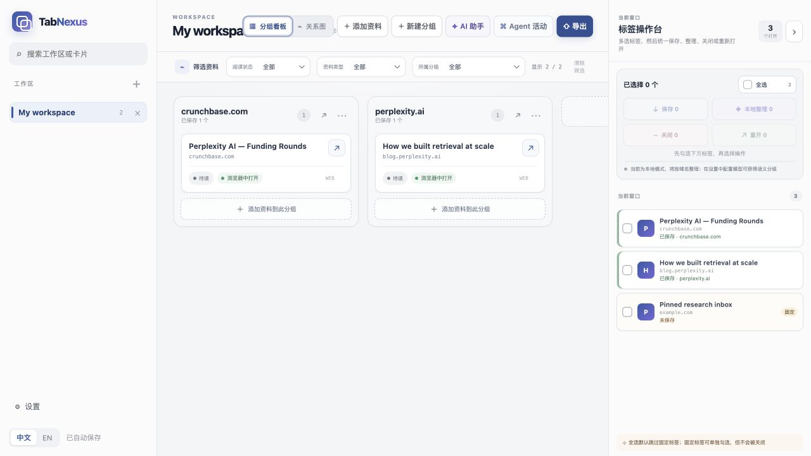
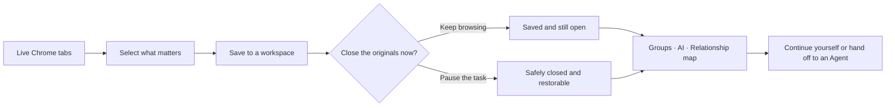
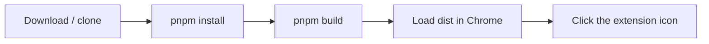
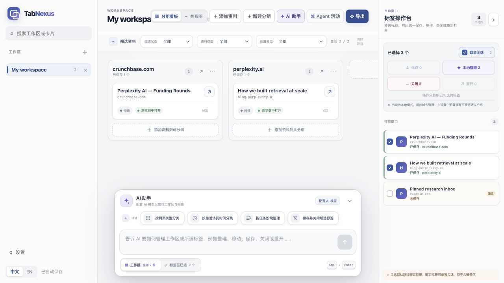
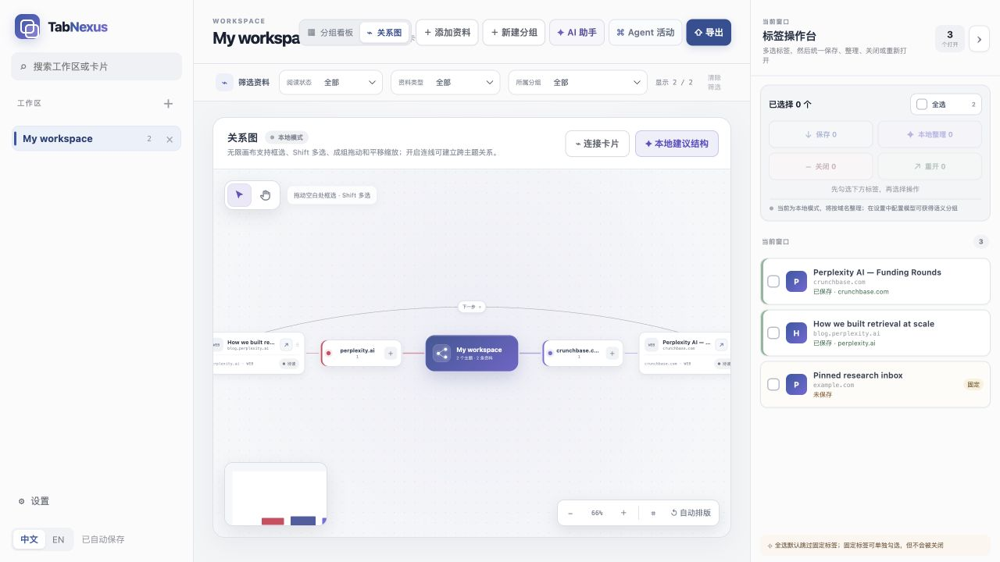
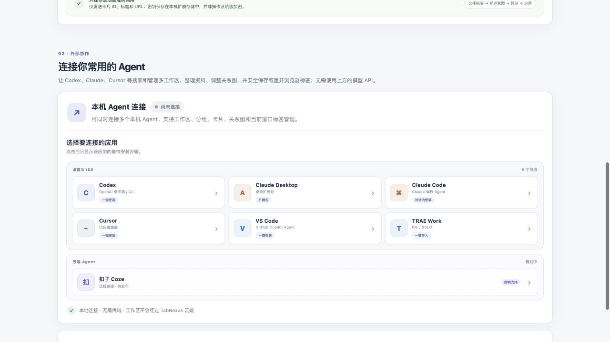
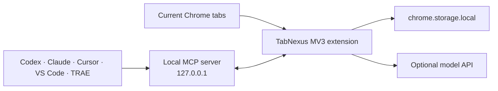

<div align="center">
  
  <h1>TabNexus</h1>
  <p><strong>Turn the tabs you are afraid to close into a workspace you can actually resume.</strong></p>
  <p>A local-first Chrome workspace that preserves browsing context, organizes it around your intent, and hands it to an AI Agent when you want help.</p>

  <p>
    <a href="#install-now">Install</a> ·
    <a href="#your-first-five-minutes">First use</a> ·
    <a href="#three-outcomes-that-matter">Benefits</a> ·
    <a href="#connect-an-ai-agent">Agent MCP</a> ·
    <a href="../README.md">简体中文</a>
  </p>
</div>



> [!IMPORTANT]
> **v0.17.0 is a developer preview.** TabNexus is a Chrome extension, not a website. Today you build it from source and load the generated `dist` folder in `chrome://extensions`; a Chrome Web Store build is not available yet.

## The problem is not too many tabs. It is too much unfinished work.

A research task opens a report, three competitors, a paper, and two data sources. A production issue interrupts it with docs, logs, and GitHub threads. Later, a trip adds flights, visas, hotels, and guides to the same browser window.

Every tab becomes a promise to your future self: **“This still matters. Do not close it yet.”**

But once the titles collapse into favicon-sized hints, the browser can no longer tell you why a page was opened, which task it belongs to, what you already learned, or where to restart tomorrow. The browser remembers pages; it does not remember the work behind them.


**TabNexus does not merely hide tabs. It makes unfinished work safe to pause, clear to resume, and easy to hand off.**

| Before | With TabNexus |
|---|---|
| Keep everything open because closing feels risky | See what is saved, then close with confidence |
| Restore a pile of URLs and reconstruct the task from scratch | Restore groups, notes, reading states, order, and relationships |
| Re-explain the context and paste links into every AI conversation | Let an Agent read and operate the same local workspace |
| Accept a fixed topic taxonomy | Organize by type, recency, stage, priority, or your own instruction |

## TabNexus in 30 seconds



The right-side tab workbench distinguishes unsaved and open, saved and open, saved but closed, and closed without being saved. Saving and closing are separate, explicit actions. Pinned tabs are never closed in bulk.

## Install now

### Requirements

- Google Chrome 118+
- Node.js 22+
- About 3–5 minutes

### Option A: download the source

1. Use **Code → Download ZIP** on GitHub, or [download the current source directly](https://github.com/KaichenCurry/TabNexus/archive/refs/heads/main.zip).
2. Unzip it and open a terminal in the `TabNexus-main` folder.
3. Run:

```bash
corepack enable
corepack prepare pnpm@11.9.0 --activate
pnpm install --frozen-lockfile
pnpm build
```

If `corepack` is unavailable, run `npm install -g pnpm@11.9.0`, then repeat the final two commands.

### Option B: clone with Git

```bash
git clone https://github.com/KaichenCurry/TabNexus.git
cd TabNexus
corepack enable
pnpm install --frozen-lockfile
pnpm build
```

### Load it into Chrome

1. Open `chrome://extensions`.
2. Enable **Developer mode**.
3. Click **Load unpacked**.
4. Select the generated `TabNexus/dist` folder—not the repository root.
5. Pin TabNexus and click its toolbar icon.



For local `file://...html` pages, enable **Allow access to file URLs** in the extension details. TabNexus does not replace your new-tab page and does not use Chrome's Side Panel.

## Your first five minutes

1. **Select, rather than capture everything.** Check the tabs that belong to the task; Select all skips pinned tabs by default.
2. **Save them.** They enter the active workspace while the original pages remain open by default.
3. **Close only when you choose.** Closing a browser tab does not delete its workspace card.
4. **Build the structure.** Drag cards into groups, describe a grouping rule to AI, or use the relationship map.
5. **Resume without duplicates.** Open one card, one group, or the whole workspace; URLs already open are skipped.

## Three outcomes that matter

### 1. Close tabs without losing the work

TabNexus preserves groups, order, notes, reading states, and relationships—not just URLs. The workspace survives Chrome and extension restarts, and restores only pages that are missing.

**The outcome is not merely a cleaner tab strip. It is the confidence that the task is safe to pause.**


### 2. AI organization that follows your instruction

Run AI on the whole workspace or only the tabs selected on the right. Ask for page type, recent access time, workflow stage, priority, or any custom rule. TabNexus shows the basis and proposed actions before applying them, and lets you redirect individual pages.

DeepSeek, OpenAI, Claude, Kimi, Qwen, and MiniMax are optional. Without a key, deterministic local domain grouping remains available.

**The structure follows the work instead of forcing the work into a fixed topic taxonomy.**



### 3. See relationships a folder cannot express

The same cards can switch to an Obsidian-inspired infinite canvas with selection, group movement, pan and zoom, minimap, automatic layout, and persistent editable connections.

**When a task is not a linear list, you can still see how evidence, decisions, and next steps connect.**



## Connect an AI Agent

TabNexus can be the local context layer for Codex, Claude, Cursor, VS Code, and TRAE. Through MCP, an Agent can search workspaces, classify and move material, edit relationship layouts, and safely save or restore browser tabs—without repeatedly asking you to paste a flat URL list.



| Client | Local support | Integration |
|---|---:|---|
| Codex | ✅ | Repository plugin package |
| Claude Desktop | ✅ | Self-contained `.mcpb` bundle |
| Claude Code | ✅ | Repository marketplace plugin |
| Cursor | ✅ | Standard local MCP configuration |
| VS Code / Copilot Agent | ✅ | VS Code MCP configuration |
| TRAE Work | ✅ | Standard local MCP configuration |
| Coze | Planned | Requires an authenticated remote MCP gateway |

The local MCP exposes **17 tools** across workspaces, groups, cards, relationship layout, tab selection, capture, restore, export, and guarded destructive actions. Multiple Agents can connect at the same time; revision checks and idempotent operation IDs prevent stale sessions from silently overwriting newer work.

After loading the extension, open **Settings → Connect your Agent**. See the [client adapter guide](AGENT_CLIENT_ADAPTERS.md), [capability matrix](MCP_CAPABILITY_MATRIX.md), and [testing guide](MCP_TESTING.md).

## Privacy and security

- Local-first storage; no TabNexus account or cloud database.
- No content scripts, `<all_urls>`, `webRequest`, `downloads`, or new-tab override.
- AI sends only the minimum card IDs, titles, and URLs required for the operation—never notes or provider keys.
- MCP listens only on `127.0.0.1` and never exposes provider keys.
- Exports exclude settings, credentials, and ephemeral Chrome tab IDs.
- Pinned tabs may be saved explicitly but cannot be closed through bulk actions or MCP.

Read the [security policy](../.github/SECURITY.md) before reporting a vulnerability. Never place a real provider key in an issue, screenshot, fixture, or export.

## Development

```bash
pnpm dev                  # preview the real UI with synthetic tabs
pnpm typecheck
pnpm test                 # unit, component, manifest, and Chrome API tests
pnpm test:e2e             # extension E2E in Chrome for Testing
pnpm check                # typecheck, tests, MCP contract, and production build
pnpm mcp:test             # exercise all 17 tools through a real stdio process
pnpm eval:mcp:validate    # validate the curated 600-query MCP dataset
```

Current automated baseline: **106 tests, 17/17 MCP tools, and 36/36 deterministic capability checks**.

<details>
<summary><strong>Repository layout</strong></summary>

```text
agent/   MCP bridge, client adapters, and Agent plugins
docs/    product, implementation, testing, and public documentation
public/  Chrome manifest, icons, and release assets
scripts/ build, install, audit, and evaluation scripts
src/     React workspace, settings, data, and Chrome service logic
tests/   unit, component, E2E, fixtures, and MCP evaluation data
```

The repository root keeps only build configuration, licensing, changelog, and project entry files. The historical PRD is archived at [`docs/product/PRD.md`](product/PRD.md).
</details>

## Architecture



Stack: React, TypeScript, Vite, Vitest, Playwright, Chrome Manifest V3, and Model Context Protocol. All runtime code and fonts ship with the extension; no remote-hosted code is executed.

## Contributing

Issues, product feedback, documentation improvements, provider adapters, accessibility fixes, and focused pull requests are welcome. Start with the [contributing guide](../.github/CONTRIBUTING.md) and follow the [Code of Conduct](../.github/CODE_OF_CONDUCT.md).

## License

TabNexus is available under the [MIT License](../LICENSE).

---

<div align="center">
  <strong>Your browser remembers the pages. TabNexus remembers why you opened them and what comes next.</strong>
</div>
