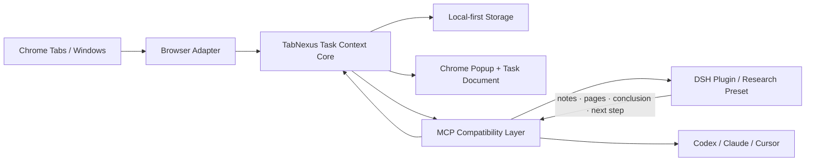

# TabNexus 全量重构方案 v3.0

> **⚠️ 地位说明（2026-08-15 更新）：本文为参考方案，唯一执行基线是 [BLUEPRINT.md](BLUEPRINT.md)（主设计由主开发 AI 负责）。本文保留用于：界面审计、DSH 调研、风险清单与决策追溯；与 BLUEPRINT 冲突时以 BLUEPRINT 为准。**

> 状态：参考材料  
> 日期：2026-08-15  
> 结论：废弃“分组看板 + 关系图 + 标签操作台 + AI 助手”的旧主路径，重建为“任务上下文文档”  
> 兼容原则：重做产品外壳和运行逻辑，保留已经验证可靠的浏览器、存储、MCP 与安全引擎

> **📌 用户三项拍板决策修订（2026-08-15 晚于本文初稿，优先级最高；与正文冲突处以本节为准）**
>
> 1. **关系图保留，升级为一级画布视图，采用 Excalidraw 手绘风格；AI（内置 API 或 Agent）可修改画布样式与关系。** → 修正 §3.2 / §9.1 / Phase 3 / 风险 6 中"可选研究画布"的降级表述；技术规格见 §9.1–9.2（已按 npm 事实核验）。
> 2. **分组不固定，完全由用户 + AI 提示词意图管理：支持一键总结、按内容语义 / 按时间 / 按域名 / 自定义提示词划分。** → 新增 §6.5 归位模式；与 §6.3"不默认按域名伪装分组"不冲突——域名只是用户主动选择的模式之一，不是静默默认。
> 3. **结论与进度做成可视化任务进度条。** → 新增 §4.7 分段式任务进度条规格，并并入任务头（§4.3）。

---

## 0. 一页结论

TabNexus 不应继续被定义为 Tab Manager，也不应只是一个“把 Tab 分类保存起来”的工具。

新的产品定位是：

> **TabNexus 是浏览器与 Agent 之间的任务上下文层。它把散落的 Tab 变成一份人和 Agent 都能继续编辑的任务文档。**

核心隐喻：

- 浏览器 Tab 是正在打开的临时页；
- Tab 被收进 TabNexus 后，成为持久化的 **Page（文件页）**；
- 一组围绕同一目标的 Page，不再放进文件夹或看板，而是组成一份持续生长的 **Task Document（任务上下文文档）**；
- Chrome 扩展负责采集、控制和展示；
- DSH / Codex / Claude 等 Agent 通过 MCP 读取和继续编辑同一份文档。

一句话版本：

> **把 50 个 Tab，变成一份能继续做、能交给 AI、也能真正收尾的任务文档。**

本次重构不沿用旧版以下主路径：

```text
保存标签 → 域名/AI 分组 → 分组看板 → 关系图 → 导出
```

替换为一条更短的闭环：

```text
明确目标 → 收进相关页 → 在任务文档里理解和编排 → 人/Agent 共同推进 → 形成结论并归档
```

这不是把旧 UI 换皮，而是更换产品一级对象、默认界面和核心行为。

---

## 1. 审查依据与当前诊断

### 1.1 本轮实际检查范围

本方案基于以下证据，而不是只看 README：

- Chrome 中确认当前 TabNexus 扩展页已加载；由于 Chrome 自动化安全策略禁止直接接管 `chrome-extension://` 页面，交互证据以仓库现有的真实扩展 E2E/UX 审计结果为准；
- 检查了 `artifacts/ux-audit/` 的十张完整流程截图：空状态、选择、保存、本地整理、AI 输入区、关系图、教程、设置页；
- 检查了 `WorkspaceApp.tsx`、`OpenTabsRail.tsx`、`FlowCanvas.tsx`、`GroupPanel.tsx`、`styles.css` 和 i18n；
- 检查了 `types.ts`、storage、grouping、export、tab workbench、MCP bridge 和测试；
- 在 Chrome 中实际检查了正在运行的 DSH Web UI；
- 检查了本机 `@deepseek-ai/dsh@0.1.0-rc.6`、`@deepseek-ai/dsh-mcp-client` 和 Agent Preset 相关包。

### 1.2 当前产品的根本问题

当前产品不是功能少，而是一级对象错了。

界面把以下对象同时放在第一层：工作区、分组、卡片、资料、标签、标签操作台、筛选、关系图、AI 助手、Agent 活动、导出。用户需要先理解工具内部结构，才能开始做自己的事情。

代码也证明当前模型仍然是“文件夹式标签管理器”：

```ts
type Workspace = {
  id: string;
  name: string;
  groupOrder: string[];
  groups: Record<string, Group>;
  cards: Record<string, Card>;
  edges: Edge[];
};
```

它没有：

- 用户这次到底想完成什么；
- 当前判断和结论是什么；
- 下一步应该做什么；
- 哪些 Page 已经被采用，哪些被排除以及为什么；
- Agent 的产出应该写回哪里。

所以当前 Workspace 只能成为一个容器，不能成为“任务上下文”。

### 1.3 现有界面的主要症状

1. 空任务中仍然出现大量按钮、筛选器、状态说明和禁用操作；
2. 中央分组看板与右侧标签操作台同时管理同一批对象；
3. 唯一实心主按钮是“导出”，战略信号错误；
4. “AI 整理 / 智能整理 / 本地整理 / AI 助手”表达的是同一能力，却用了多套命名；
5. 默认本地逻辑按域名分组，正好违背“理解用户为什么打开它”的定位；
6. 关系图是一个与主任务割裂的平行世界，不直接帮助用户形成结论；
7. 教程在解释功能，而不是让用户在第一分钟完成一件真实任务；
8. MCP 和 Agent 是最有差异化的能力，却被藏在设置和活动弹窗里。

因此，本次重构不能继续在 `WorkspaceApp.tsx` 上堆条件和按钮。

---

## 2. 产品定位与三大问题

### 2.1 目标用户

优先服务以下人群，而不是所有 Chrome 用户：

- 每天通过浏览器处理复杂任务的产品经理、开发者、研究人员、咨询顾问和内容创作者；
- 经常为一个任务打开 10–50 个页面；
- 任务会跨小时或跨天；
- 最终需要把浏览器里的上下文交给 AI/Agent 继续处理。

核心 JTBD：

> 当一个浏览器任务已经大到无法靠记忆维持时，我希望保留每个页面为什么重要、我做到哪里、下一步是什么，并把整份上下文直接交给 Agent，这样我不用一直开着几十个 Tab，也不用重新解释一遍。

### 2.2 三大问题

#### P1：记不住——Tab 只保留地址，不保留“为什么”

浏览器能恢复标题和 URL，但无法恢复用户当时的判断、备注、取舍和下一步。用户只能通过“不关 Tab”来维持记忆。

TabNexus 的解决方式：

- 任务目标和下一步常驻；
- Page 带备注、阅读/采用/排除状态；
- 自定义章节表达用户自己的思路，而不是域名；
- 关闭原 Tab 后，上下文仍然存在。

#### P2：传不走——浏览器上下文无法无损交给 Agent

用户必须复制十几个链接，再解释每个页面的作用。Agent 即使重新读取当前 Tab，也看不到过去关闭的页面、用户排除的证据和之前的判断。

TabNexus 的解决方式：

- 生成结构化 Context Packet，而不是平铺 URL；
- 通过 MCP 让 Agent 读取任务目标、章节、备注、采用项、排除项和下一步；
- Agent 的结论、补充条目和状态修改写回同一份任务文档；
- Chrome 扩展与 DSH 插件共用一个数据源。

#### P3：收不拢——保存了页面，却没有形成交付物

传统 Tab Manager 的终点是“保存成功”。但用户打开 30 个 Tab 的真正目的，是完成调研、做出决策、解决 Bug 或交付报告。

TabNexus 的解决方式：

- 任务文档本身就是持续生长的交付物；
- 当前结论和下一步是一等字段；
- Agent 可以补缺口、写草稿、生成 Artifact；
- 完成后归档任务，并安全关闭相关 Tab。

### 2.3 明确不解决

本阶段不做：

- 通用书签收藏器；
- 云端团队知识库；
- 自动读取所有网页正文；
- 浏览器历史记录替代品；
- Notion 式通用富文本编辑器；
- 自动替用户关闭或删除内容；
- 为了“看起来智能”而增加的自动分类功能。

---

## 3. 新产品范式：任务上下文文档

### 3.1 新的一级对象

产品只保留五个用户可理解的概念：

| 概念 | 用户理解 | 系统含义 |
|---|---|---|
| 任务 Task | 我正在完成的一件事 | 一份持久上下文文档 |
| 页 Page | 为这件事打开或保存的一页 | URL、标题、备注、状态与来源 |
| 章节 Section | 我如何组织这件事 | 用户自定义的文档结构 |
| 结论 Conclusion | 当前得到的答案 | 用户或 Agent 可继续编辑的结果 |
| Agent | 和我共同推进任务的协作者 | 通过 MCP 读写任务上下文 |

不再把“工作区、分组、卡片、资料、标签操作台”同时暴露给用户。

### 3.2 为什么默认界面必须是文档，而不是看板

看板擅长表达状态流转，关系图擅长表达节点关系，但用户打开大量 Tab 的最终目的通常是形成理解和产出。

文档更符合这个任务：

- Page 天然可以作为引用条目嵌入正文；
- 备注可以直接成为内容，而不是藏在弹窗里；
- 章节可以按用户自己的思路组织，不需要固定角色；
- 结论、下一步和 Agent 产出可以留在同一处；
- Markdown/Agent Context 可以所见即所得地生成。

因此：

> **任务文档是唯一默认主界面。看板不再存在。空间关系是文档的平行视图——文档/画布双视图（Excalidraw 手绘画布），按用户拍板决策升级为一级视图；画布交付在 Phase 3，不阻塞文档 MVP（Phase 1–2）。**

### 3.3 章节不固定

章节必须允许用户自由命名、排序、折叠和删除。

系统可以提供可选模板，但不能强制：

- 竞品调研：市场、产品、定价、用户反馈、待验证；
- Bug 排查：现象、线索、假设、验证、修复结论；
- 内容写作：素材、论点、反例、草稿、成稿；
- 空白任务：用户自己创建章节。

AI 只能“建议结构”，不能把用户锁进固定分类。

### 3.4 Page 的最低信息结构

每个 Page 在文档中是一条紧凑的引用块：

```text
▎已采用  Perplexity 融资轮次                    ↗
          估值 90 亿，但没有披露 ARR；可支撑增长判断
          crunchbase.com · 2 小时前
```

默认显示：

- 状态：未读 / 已读 / 已采用 / 已排除；
- 标题；
- 用户备注摘要；
- 域名和更新时间；
- 打开原页按钮。

展开后显示：

- 完整备注；
- 排除原因；
- 来源（用户 / AI / Agent）；
- 与其他条目的关系；
- 最近活动。

“WEB”这类格式标签不应占据主要信息位。

---

## 4. 新信息架构与界面

### 4.1 Chrome 扩展采用双入口

#### 入口 A：工具栏快速收集 Popup

用户点击扩展图标时，不应立刻进入复杂工作台，而应看到一个极简收集面板：

```text
┌──────────────────────────────┐
│ TabNexus                     │
│ 当前页                       │
│ GitHub · DeepSeek Harness    │
│                              │
│ 保存到  [竞品调研       ▾]   │
│ [保存当前页]  [选择窗口页面] │
│                              │
│ 打开任务文档                 │
└──────────────────────────────┘
```

目标：保存当前页到最近任务不超过两次点击。

#### 入口 B：全页任务文档

全页界面负责理解、编排、继续与完成，不再负责展示所有低频功能。

### 4.2 默认全页布局

```text
┌────────────┬──────────────────────────────────────────────┐
│ 任务       │ 评估 Perplexity 是否值得对标                 │
│            │ 目标：理解商业模式、增长与风险                │
│ ● 竞品调研 │ 下一步：补一个失败案例     12/18 已处理       │
│   今天     │                         [让 Agent 继续] [⋯]   │
│            │ ───────────────────────────────────────────  │
│ ○ Bug 排查 │ 大纲                                         │
│   昨天     │                                              │
│            │ 市场与商业模式                               │
│ ＋ 新任务  │ ▎已采用  Perplexity 融资轮次                 │
│            │           估值 90 亿，但未披露 ARR            │
│            │ ▎已读    AI 搜索市场规模                     │
│            │                                              │
│            │ 风险与反例                                   │
│            │ ▎已排除  2023 年产品测评                     │
│            │           已过期，不能用于当前产品判断         │
│            │                                              │
│            │ 当前结论                                     │
│            │ Perplexity 值得研究，但短期不宜直接复制……     │
│            │                                              │
│ ⚙ 设置     │                           [收件箱 6]          │
└────────────┴──────────────────────────────────────────────┘
```

默认只有两列：任务导航 + 文档正文。

收件箱、活动记录、Agent 详情都使用临时 Drawer，不常驻第三列。

### 4.3 任务头

任务头包含且只包含：

- 任务标题；
- 一句话目标；
- 下一步；
- 分段式可视化进度条（规格见 §4.7）；
- Agent 连接状态；
- 一个主操作：“让 Agent 继续”；
- 一个更多菜单。

更多菜单承载：归档、导出、设置模板、删除任务等低频操作。

### 4.4 Context Inbox

Inbox 不再是“标签操作台”，只负责一件事：把当前浏览器页收进任务。

交互规则：

- 默认只显示尚未收进当前任务的可用 Tab；
- 已保存 Tab 折叠为一行；
- 固定 Tab 默认不选；
- 选中后只出现一个主按钮：“收进任务 N”；
- “保存并关闭”放在按钮的下拉菜单中；
- 关闭、重开、整理不再以四个常驻按钮出现；
- Inbox 完成收集后自动收起。

### 4.5 空状态

第一次打开只问一个问题：

```text
你现在想完成什么？

[ 例如：评估 Perplexity 是否值得作为竞品对标         ]

[创建任务并选择相关页面]
```

创建后立即打开 Inbox，选择页面，形成第一份任务文档。

不展示教程轮播，不提前解释看板、关系图、AI 模型和 Agent 安装。

### 4.6 搜索与命令

常用低频能力统一进入 `Cmd/Ctrl + K`：

- 搜索任务和 Page；
- 创建任务/章节；
- 移动 Page；
- 标记状态；
- 打开 Inbox；
- 让 AI 建议结构；
- 导出或归档。

这样可以保持界面简洁，同时服务高级用户。

### 4.7 分段式任务进度条（用户拍板：结论与进度可视化）

任务头第二行固定为进度条（GitHub milestone 风格）：

```text
▓▓▓▓▓▓▓▓▓░░░  12/18 已读 · ⭐ 3 已采用
└─市场与商业模式─┘└─风险与反例─┘└─未归类─┘
```

规格：

- **一段 = 一个章节**：段宽 ∝ 章节内 Page 数，段色 = 章节色（受限调色板，非随机）；
- **段内填充 = 章节阅读进度**：未读 0% / 已读 50% / 已采用 100%，按 Page 数加权平均；
- **段可点击** → 文档滚动定位到对应章节；
- 右侧常显两个数字：`已读/总数` 与 `⭐已采用`（已采用单独计星，是"证据强度"而非阅读量）；
- **可交付态**：全部 Page 已读且 ≥1 已采用 → 进度条高亮，「让 Agent 继续」「AI 总结」随之高亮；
- **结论区**（文档尾部固定区块）：显示"当前结论"文本 + 「AI 总结」按钮；写结论 = 完成度 +1 ⭐，与进度条双向联动。

---

## 5. 新运行逻辑

### 5.1 首次使用

1. 用户输入任务目标；
2. TabNexus 显示当前窗口可收集的 Tab；
3. 用户选择并点击“收进任务”；
4. 任务文档立即出现 Page 引用；
5. 系统可建议 2–4 个自定义章节，用户可以接受、编辑或完全忽略。

第一分钟必须完成真实工作，不播放功能介绍。

### 5.2 日常收集

两条路径：

- 单页：工具栏 Popup → 保存到最近任务；
- 批量：任务文档 → Inbox → 选择窗口页面 → 收进任务。

保存动作只做持久化，不自动按域名建章节。

### 5.3 理解与编排

用户可以：

- 直接拖动 Page 到任意自定义章节；
- 写备注并标记状态；
- 创建文本、决策或 Artifact 条目；
- 选择若干 Page，让 AI 建议如何放入现有结构；
- 让 AI 建议新章节，但必须以可编辑 Diff 呈现。

### 5.4 继续任务

重新进入任务时，第一屏展示：

- 上次的目标；
- 下一步；
- 最近变化；
- 未读/已采用/已排除数量；
- Agent 是否连接。

系统恢复文档滚动位置，但不自动重开全部 Tab。

用户主动选择“打开本章节相关页”或“恢复选中页”。

### 5.5 Agent 接手

“让 Agent 继续”打开一个简短面板：

```text
让 Agent 做什么？
[根据当前材料补充反例并更新结论                 ]

将提供：目标、章节、18 个 Page、备注、状态、排除原因、下一步
不会提供：网页正文、API Key、未选中的其他任务

[预览上下文] [开始]
```

Agent 的修改以三种方式写回：

- 新增 Page / Note / Artifact；
- 修改 Page 状态或备注；
- 更新下一步、当前结论或章节结构。

所有写入进入任务 Timeline；结构变化和批量操作必须可预览、可撤销。

### 5.6 完成与归档

当任务已有结论时，显示“完成任务”：

- 确认当前结论；
- 选择是否关闭仍打开的相关 Tab；
- 生成 Markdown / JSON Context Packet；
- 将任务移入归档，但可随时恢复。

“导出”不再是主 CTA，而是完成/交付的一部分。

---

## 6. AI 与 Agent 设计

### 6.1 一个入口，不再有四套 AI 名词

界面统一使用：

- 动词：“协助”或“让 Agent 继续”；
- 结果：“建议”与“修改”；
- 不向用户暴露“本地整理 / AI 整理 / 智能整理”的实现差异。

执行路由：

1. 已连接 DSH/Codex 等 Agent：优先使用 Agent；
2. 未连接 Agent、但配置了模型 API：使用扩展内模型；
3. 两者都没有：保留完全可用的手动模式，不按域名伪装成语义整理。

### 6.2 AI 应该做什么

- 根据目标建议自定义章节；
- 从现有备注和元数据中发现重复、冲突和缺口；
- 建议下一步；
- 草拟当前结论；
- 把 Agent 新产物写回任务；
- 根据用户指令修改关系画布（Excalidraw，§9.1–9.2）。

### 6.3 AI 不应该做什么

- 未经确认发送所有 Tab；
- 假装读取了没有权限访问的网页正文；
- 自动关闭 Tab；
- 自动覆盖用户章节；
- 静默删除或合并条目；
- 在没有模型时默认按域名创建“智能分组”。

### 6.4 隐私边界

基础模式继续只使用最小权限：

- 浏览器 Tab 元数据；
- 用户明确写入的备注；
- 用户选中的任务和 Page。

网页正文读取、`file://`、AI API 域名和其他高权限能力应逐步迁移为可选权限，在用户首次使用对应能力时再申请。

### 6.5 归位模式与一键总结（用户拍板：分组完全由意图驱动）

归位入口位于文档顶部"未归类"区旁：[✦ 归位] → 选择模式：

| 模式 | 行为 | 依赖 |
|---|---|---|
| 按内容理解 | AI 语义分组 + 逐条归类理由 | 模型 API |
| 按时间 | 今天 / 本周 / 更早，纯本地 | 无 |
| 按域名 | 域名聚合，纯本地（用户**主动选择**，非静默默认） | 无 |
| 自定义提示词 | 如"按背景、证据、反例、结论" | 模型 API |

- 每次归位 = 一次全新分组建议 → **可编辑预览 → 用户确认应用**；不强制任何固定结构；
- **一键总结**：对当前任务全部 Page（仅标题 / URL / 备注 / 状态，不发正文）生成结构化摘要，写入结论区，可继续人工编辑；
- 未配置 AI 时：按时间 / 按域名照常可用；按内容 / 自定义提示词引导用户配置 AI（不伪装、不降级欺骗）。

---

## 7. Chrome 与 DSH：一个内核，两种入口

### 7.1 产品边界

| 层 | Chrome 扩展 | DSH 插件 / Agent |
|---|---|---|
| 主要职责 | 捕获、展示、恢复、控制浏览器 Tab | 理解、推理、补充、生成、推进任务 |
| 权限 | `chrome.tabs`、本地 storage、可选 file 权限 | DSH 工具、模型与工作流 |
| 默认 UI | Popup + 任务上下文文档 | DSH 对话与 Agent Preset |
| 数据源 | 唯一事实源 | 通过 MCP 读取和写回 |
| 离线能力 | 手动收集、查看、编辑、恢复 | 取决于 Agent 环境 |

结论：不能在 Chrome 与 DSH 各做一套任务数据和 UI。

### 7.2 架构



### 7.3 DSH 分三层落地

#### Layer 1：MCP 直连

先用 DSH 已有的 `@deepseek-ai/dsh-mcp-client` 连接当前 TabNexus MCP Server。该包会把工具注册为 `mcp__tabnexus__<tool>`，无需重写通信协议。

目标：验证 DSH 可以稳定读取、修改并写回真实任务。

#### Layer 2：TabNexus Skill + Research Preset

提供一套专用说明：

- 先读取当前任务；
- 尊重已排除 Page；
- 不重复用户已经否定的方向；
- 产出必须写回任务文档；
- 结构修改先预览；
- 浏览器关闭等副作用必须确认。

这是 DSH 用户能直接感知的产品能力，比单纯暴露 17 个工具更重要。

#### Layer 3：正式 Cordis 插件包

在 DSH 插件接口稳定后，再打包：

- MCP 连接配置；
- Skill 与 Preset；
- 连接状态与设置；
- 打开 TabNexus 任务的深链接；
- 插件安装与升级流程。

DSH 当前仍是 RC 版本，完整 Cordis UI 插件不应早于 MCP + Preset 验证。

### 7.4 对外叙事

面向普通用户：

> **你的浏览器任务文档。几十个 Tab，也能接着做。**

面向 AI 用户：

> **把浏览器上下文整份交给 Agent，不再逐条复制链接。**

面向 DSH 开发者：

> **一切皆插件，每个 Tab 都可以成为可复用、可组合、可继续执行的任务上下文。**

---

## 8. Schema v2

### 8.1 新领域模型

```ts
type TaskStatus = "active" | "paused" | "done" | "archived";
type EntryState = "unread" | "read" | "adopted" | "excluded";
type EntryKind = "page" | "note" | "artifact";

type TaskDocument = {
  id: string;
  title: string;
  objective: string;
  nextStep: string;
  conclusion: string;
  status: TaskStatus;
  createdAt: string;
  updatedAt: string;
  completedAt?: string;
  sectionOrder: string[];
  sections: Record<string, Section>;
  entries: Record<string, Entry>;
  relations: Relation[];
};

type Section = {
  id: string;
  title: string;
  summary?: string;
  entryIds: string[];
  collapsed?: boolean;
};

type Entry = {
  id: string;
  kind: EntryKind;
  title: string;
  url?: string;
  favicon?: string;
  body: string;
  state: EntryState;
  excludedReason?: string;
  sectionId: string | null;
  source: "user" | "ai" | "agent";
  savedAt?: string;
  lastAccessedAt?: string;
};

type Relation = {
  fromEntryId: string;
  toEntryId: string;
  label?: string;
  scene?: Record<string, unknown>;
};
```

### 8.2 迁移规则

旧数据必须无损迁移：

- Workspace → TaskDocument；
- Workspace.name → TaskDocument.title；
- Group → Section；
- Card → Entry；
- Card.note → Entry.body；
- unread/read/adopted 原样保留；
- 未分组 Card → 文档顶部“待编排”区域；
- Edge → Relation；
- objective、nextStep、conclusion 初始为空；
- 原始 JSON 保留一次只读备份，直到用户成功打开并保存 v2。

### 8.3 Context Packet v2

Agent 读取的默认数据应包含：

```json
{
  "task": {
    "title": "评估 Perplexity 是否值得对标",
    "objective": "理解商业模式、增长与风险",
    "nextStep": "补一个失败案例",
    "conclusion": "当前判断……"
  },
  "sections": [],
  "adopted": [],
  "excluded": [],
  "artifacts": [],
  "relations": []
}
```

必须保留排除项和排除原因。这是“真实任务记忆”与“重新读取当前网页”的关键区别。

### 8.4 MCP 兼容

不要直接删除现有 17 个工具。

建议：

- v1 `read_workspace`、`edit_workspace` 等继续工作；
- 内部通过 Compatibility Adapter 映射到 TaskDocument；
- 新增更简洁的 v2 任务工具；
- v1 至少保留一个大版本周期，并在活动日志中记录兼容调用。

v2 工具建议控制在 7 个左右：

- `list_tasks`；
- `read_task_context`；
- `update_task`；
- `collect_pages`；
- `update_entries`；
- `write_artifact`；
- `control_browser_tabs`。

---

## 9. 旧功能裁决

| 当前能力 | 裁决 | 新位置 |
|---|---|---|
| 分组看板 | 删除 | 任务文档 + 自定义章节 |
| 顶部看板/关系图切换 | 删除 | 单一默认文档界面 |
| 当前 FlowCanvas | 从主产品删除 | 未来可选嵌入式研究画布 |
| GroupPanel | 删除 UI | 数据迁移为 Section |
| 右侧标签操作台 | 删除 | Popup + 临时 Inbox Drawer |
| 常驻筛选栏 | 删除 | 搜索、命令面板、章节折叠 |
| AI 助手 Dock | 删除 | 文档内协助入口 + Agent 面板 |
| 域名分组兜底 | 删除默认行为 | 仅作为手动排序选项 |
| 3 步教程 | 删除 | 首次真实任务引导 |
| 导出主按钮 | 降级 | 完成/交付菜单 |
| Agent 活动弹窗 | 重做 | 任务 Timeline Drawer |
| Notes | 强化 | 直接显示在 Page 正面 |
| 保存/关闭/重开 | 保留引擎 | Popup、Inbox 和上下文菜单 |
| URL 去重、固定标签保护 | 保留 | 底层规则 |
| 本地优先 storage | 保留 | 唯一事实源 |
| 撤销和破坏性确认 | 保留并加强 | 所有 Agent 写入与批量动作 |
| Markdown/JSON 导出 | 保留并重写 | Context Packet v2 |
| MCP Bridge | 保留 | Chrome/DSH 共用神经层 |
| 6 个 AI Provider | 功能可保留，界面降级 | 设置 → 高级连接 |

### 9.1 画布：文档的平行视图（用户拍板：Excalidraw 一级视图）

视图切换为两个纯文字 Tab：`[文档] [画布]`。画布与文档共享同一份任务数据，不是独立平行世界：

- **引擎**：`@excalidraw/excalidraw`（**v0.18.1，MIT**，peerDeps 支持 React 19，已按 npm 事实核验）；**动态 import 惰性加载**，仅在首次打开画布时下载，不影响扩展冷启动；
- **映射**：Page = 手绘风节点（章节色描边 + 状态角标），关系 edge = 手绘箭头（边上 label 文本），章节 = 低透明度容器框；
- **持久化**：elements JSON 经 pako（包自带依赖）gzip 压缩后写入 workspace；manifest 增补 `unlimitedStorage` 权限（商店审核如实披露用途）；
- **已知坑**：[excalidraw issue #7585](https://github.com/excalidraw/excalidraw/issues/7585)（updateScene 与 initialData 的覆盖时序）——集成 POC 第一周必须验证并固化正确用法；
- 画布故障或未打开时，不影响文档闭环；但画布本身是**一级视图**，不是埋在章节里的 Artifact。

### 9.2 AI 编辑画布（用户拍板：AI 可改样式与关系）

三层编辑，全部遵循"**JSON 变更 → 校验 → 预览 → 应用 → 可撤销**"：

| 层 | 触发 | 能力 |
|---|---|---|
| 人 | 画布上手绘 / 拖拽 / 连线 | Excalidraw 原生交互 |
| 内置 AI API | 画布工具栏「✨ 整理画布」+ 意图输入（如"按证据链从左到右排""给结论节点换红色"） | LLM 输出画布变更 JSON：移动节点 / 改样式（描边色、填充、手绘感）/ 增删箭头 / 重排布局 |
| Agent | MCP 新工具 | 见下 |

**变更校验器（必做）**：只允许引用存在的 Page id；坐标 / 尺寸限幅；颜色限调色板；每次变更记录 revision 并写入活动留痕。

**MCP 扩展 17 → 20 工具**（只做加法，兼容旧客户端）：

| 新工具 | 作用 |
|---|---|
| `read_canvas` | 读画布 JSON（元素 / 边 / 样式 / 位置摘要） |
| `propose_canvas` | Agent 建议画布变更（走 Agent 活动审查流，用户确认后应用） |
| `edit_canvas` | 携带 expectedRevision 的直接编辑（版本校验 + 幂等收据，同 `edit_workspace`） |

---

## 10. 视觉与交互规范

### 10.1 视觉目标

关键词：安静、可信、精确、轻量、可持续阅读。

不是：炫技、过度圆角、卡片套卡片、到处紫色、功能清单式按钮。

### 10.2 基础规范

| 项目 | 规范 |
|---|---|
| 页面背景 | 中性灰白，不使用大面积渐变 |
| 主文档宽度 | 760–840px，保证长时间阅读 |
| 强调色 | 全局一个主色，只用于主操作和焦点 |
| 状态色 | 仅用于未读/采用/排除，不给章节随机上色 |
| 卡片 | 最多一层边框，默认无阴影 |
| 圆角 | 6–8px |
| 字号 | 24/18/14/12 四级 |
| 间距 | 8px 栅格 |
| 图标 | 统一 16px 线性图标，不混用 emoji/字符/SVG 风格 |
| 动效 | 120–180ms，只表达状态变化 |

### 10.3 交互原则

- 没有对象时不显示无效操作；
- 选中后才出现批量工具；
- 一个区域只有一个主操作；
- 所有 Agent 修改都有来源标记；
- 网络传输前显示范围；
- 批量关闭、删除、覆盖和结构重排可撤销或确认；
- 鼠标和键盘都能完成核心路径；
- Toast 只报告结果，不常驻解释系统状态。

---

## 11. 工程重构方式

### 11.1 不在旧组件上继续打补丁

建议在新目录重建垂直切片：

```text
extension/src/
├── domain/
│   ├── taskDocument.ts
│   ├── contextPacket.ts
│   └── migrations/v2.ts
├── popup/
│   └── QuickCaptureApp.tsx
├── task/
│   ├── TaskApp.tsx
│   ├── TaskNavigator.tsx
│   ├── TaskHeader.tsx
│   ├── TaskDocument.tsx
│   ├── SectionBlock.tsx
│   ├── EntryBlock.tsx
│   ├── ContextInbox.tsx
│   ├── AgentHandoff.tsx
│   └── ActivityDrawer.tsx
└── adapters/
    ├── browserTabs.ts
    ├── storageV2.ts
    └── mcpCompatibility.ts
```

旧 `WorkspaceApp.tsx`、`FlowCanvas.tsx`、`GroupPanel.tsx` 和 `OpenTabsRail.tsx` 在新体验通过验收后整体退役。

### 11.2 可复用的底层能力

可以复用：

- Chrome tabs/window 采集；
- URL 标准化和去重；
- save / close / reopen；
- 固定标签保护；
- storage 持久化基础；
- AI Provider 请求和错误映射；
- MCP WebSocket/Native Host；
- revision、幂等、确认和活动记录；
- 发布脚本和测试基础设施。

不能复用为新主路径：

- WorkspaceApp 的布局与状态编排；
- domain grouping；
- board/flow view state（Excalidraw 画布复用卡片 flow 坐标与 edges 数据，仅替换渲染层与交互）；
- 旧教程；
- AI composer 的操作模型；
- 右侧 rail 的批量按钮体系。

### 11.3 复杂度约束

- 新组件单文件尽量不超过 250 行；
- TaskApp 只负责编排，不实现全部业务；
- UI 文案键目标从当前约 700+ 降到 400 以内；
- 默认首屏可见操作不超过 7 个；
- 空状态可见主操作只允许 1 个；
- 不新增第二套 Agent 数据库。

---

## 12. 实施路线

### Phase 0：规格冻结与原型（2–3 天）

- 确认本文件为新基线；
- 定稿 Schema v2 与迁移测试；
- 做 6 个关键界面线框：Popup、空状态、任务文档、Inbox、Agent Handoff、设置；
- 明确 v1 MCP 兼容策略；
- 建立新 UI feature flag，不改旧用户数据。

退出标准：产品对象、主路径和数据模型不再摇摆。

### Phase 1：Chrome 垂直切片（7–10 个开发日）

- 新 Popup 快速收集；
- 新建任务 + 选择窗口 Tab；
- 任务头、自由章节、Page 引用块；
- 备注、状态、排除原因、下一步、结论；
- Inbox Drawer；
- save/close/reopen 接入；
- Schema v1 → v2 迁移；
- 删除新界面中的看板、筛选栏和 AI Dock。

退出标准：一个新用户可以在 30 秒内把多 Tab 任务变成可继续编辑的文档。

### Phase 2：Agent 闭环与 DSH（5–7 个开发日）

- Context Packet v2；
- MCP Compatibility Adapter；
- Agent Handoff 预览；
- Agent 写回结论、下一步、Page、Artifact；
- 任务 Timeline 与撤销；
- DSH MCP 直连验证；
- TabNexus Skill + Research Preset。

退出标准：DSH Agent 能读取真实任务、尊重排除项、完成工作并写回任务文档。

### Phase 3：视觉打磨与 Excalidraw 画布（7–10 个开发日）

- 完整视觉系统和暗色模式评估；
- 50–200 Page 性能；
- 键盘和无障碍；
- Excalidraw 画布（一级视图）：文档↔画布同步、手绘持久化、惰性加载；
- 画布 AI 编辑（「整理画布」+ 校验/预览/撤销）+ MCP 画布 3 工具；
- 分段式任务进度条与结论区联动打磨；
- 设置页降噪；
- optional permissions 改造；
- Chrome Web Store 上架材料。

退出标准：核心路径稳定；画布为一级视图且 AI 可编辑，但画布故障不影响文档闭环；商店权限解释清晰。

### Phase 4：Dogfood 与发布（至少 2 周观察）

- 真实使用 10 个跨天任务；
- 收集创建、回访、Agent 接手和完成数据；
- 修正空状态、收集和恢复的摩擦；
- 再决定是否投入正式 Cordis UI 插件（画布已在 Phase 3 作为一级视图交付）。

---

## 13. 成功指标

### 北极星

**每周完成的上下文任务数**：任务至少包含目标、5 个 Page 和一个结论，并被标记为完成。

### 三大问题对应指标

| 问题 | 指标 | 首版目标 |
|---|---|---|
| 记不住 | 创建后 7 日仍被重新打开的任务比例 | ≥ 40% |
| 传不走 | 从点击“让 Agent 继续”到 Agent 获得完整 Context Packet | ≤ 10 秒 |
| 收不拢 | 活跃任务中最终写入结论并完成的比例 | ≥ 30% |

### 体验指标

- 新用户从打开扩展到创建第一份任务文档：≤ 60 秒；
- 当前页保存到最近任务：≤ 2 次点击；
- 20 个 Tab 批量收集：≤ 3 个明确动作；
- 默认首屏可见操作：≤ 7 个；
- 无数据空状态主 CTA：1 个；
- 50 个 Page 的任务中，滚动、编辑、状态切换无明显卡顿；
- Agent 批量写入均有来源记录和撤销路径。

---

## 14. 风险与控制

### 风险 1：重构变成 Notion 克隆

控制：首版只支持标题、章节、Page、纯文本 Note、结论和 Artifact 链接，不引入复杂富文本块系统。

### 风险 2：自由章节重新变得混乱

控制：提供可选模板和 AI 建议，但章节始终由用户编辑，且支持快速合并/重命名。

### 风险 3：Agent 读不到网页正文却给出过度承诺

控制：界面明确展示实际传输范围；默认只使用标题、URL、备注和状态。正文读取必须是单独、可选、授权的能力。

### 风险 4：DSH 接口快速变化

控制：先依赖 MCP 标准和 Skill/Prompt，最后再依赖 Cordis UI 插件接口。

### 风险 5：Schema v2 破坏旧数据或 MCP

控制：迁移前备份、纯函数迁移、双读验证、v1 工具兼容适配、端到端回归测试。

### 风险 6：画布吞噬主线

控制：画布是文档的平行视图而非默认首页；文档 MVP（Phase 1–2）不依赖画布；画布以惰性加载 + 独立阶段（Phase 3）交付；AI 编辑画布必须走校验 + 预览 + 撤销，不得静默改动。

---

## 15. 核心验收场景

### 场景 A：第一次使用

用户有 20 个调研 Tab，输入“评估某产品是否值得对标”，选择 12 个页面，30–60 秒内得到一份可编辑任务文档。界面中不出现分组看板、关系图、域名分组或教程轮播。

### 场景 B：第二天继续

用户重新打开任务，立刻看到目标、下一步、上次备注、未读/采用/排除状态；不需要恢复所有浏览器 Tab。

### 场景 C：自由组织与归位

用户创建任意章节，将 Page 拖入章节，标记采用或排除并说明原因。系统不强制固定角色。用户可点「✦ 归位」选择按内容 / 按时间 / 按域名 / 自定义提示词，AI 给出可编辑预览，确认后应用；也可点「AI 总结」把摘要写入结论区。

### 场景 D：交给 DSH Agent

用户点击“让 Agent 继续”，预览上下文范围。DSH 读取目标、章节、备注、排除项和下一步，完成任务后把结论和 Artifact 写回，并保留活动记录。

### 场景 E：完成任务

用户确认结论，归档任务，选择关闭相关普通 Tab。固定 Tab 不关闭；任务仍可恢复；Markdown/JSON 中包含目标、结论、下一步和排除原因。

### 场景 F：旧用户升级

旧 Workspace、Group、Card、Note、Status 和 Edge 完整迁移；旧 MCP 客户端仍能读取和编辑；用户可回滚到迁移前备份。

### 场景 G：画布与 AI 编辑（用户拍板）

用户切到「画布」视图，节点与文档 Page 同步、手绘样式持久化；点「✨ 整理画布」输入意图，AI 给出画布变更预览，确认后应用且可撤销；Agent 通过 `propose_canvas` 建议关系，用户在 Agent 活动审查中确认后写入画布。

---

## 16. 最终产品判断

TabNexus 真正有价值的不是“帮用户把标签页摆整齐”，而是：

1. 把浏览器里的临时现场变成持久任务记忆；
2. 把这份记忆变成 Agent 可直接使用的上下文接口；
3. 把保存行为推进到结论、交付和归档。

因此，重构后的产品应坚持一句话：

> **Tab 是入口，Page 是文件，Task 是文档，Agent 是协作者。**

任何新功能，如果不能让任务更容易被记住、传递或完成，就不进入主界面。
